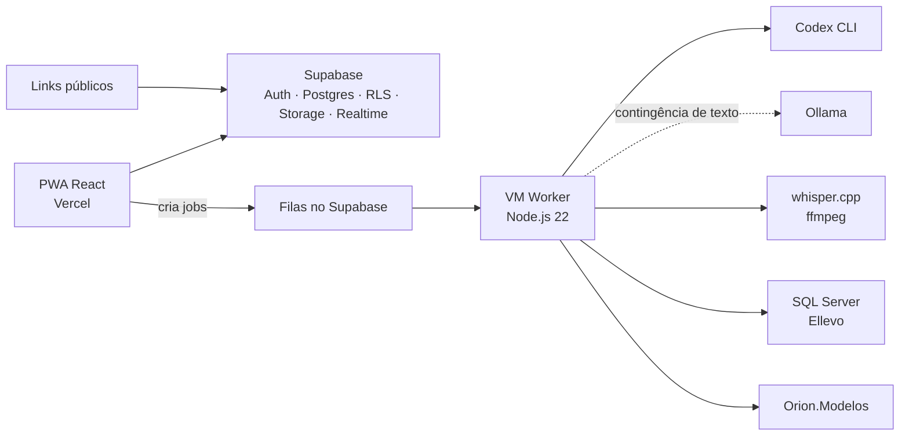

# Siplan Hub

Plataforma interna da **Siplan** para gestão do ciclo de implantação em cartórios. O sistema reúne projetos, conversão, aderência, homologação, treinamentos, atendimento, relacionamento com clientes, indicadores e administração em uma única aplicação web.

Produção: [siplanhub.vercel.app](https://siplanhub.vercel.app/)

## Visão geral

O Siplan Hub oferece:

- gestão de projetos de implantação, etapas, agendas, arquivos e responsáveis;
- dashboards, indicadores, Kanban, relatórios e acompanhamento pós-implantação;
- fluxos de conversão, homologação e geração de modelos OrionTN;
- formulários de aderência com rascunho automático, editor rico, imagens por item e parecer técnico gerado por IA;
- operação de CS/CX, NPS, visitas, rotinas, contatos e solicitações;
- base de conhecimento e indicadores de atendimento do SD;
- assistentes, chats públicos, histórico e observabilidade de automações;
- administração de usuários, equipes, permissões, auditoria, infraestrutura e changelog;
- experiência responsiva e instalável como PWA.

## Módulos principais

| Módulo | Recursos | Rotas-base |
|---|---|---|
| Dashboard | Indicadores, Kanban, pós-implantação, Copilot e chamados | `/dashboard`, `/copilot`, `/deployments` |
| Implantação | Projetos, detalhes, comparação, relatórios e implantações | `/implantacao`, `/projects`, `/reports` |
| Calendário | Calendário de projetos e agenda dos analistas | `/calendario`, `/calendar`, `/agenda-analistas` |
| Comercial | Clientes, contatos, bloqueios, timeline e checklists | `/commercial` |
| Conversão | Atividades, motores e homologação | `/conversion` |
| SD | Soluções, horas, consolidação e BI de atendimento | `/sd` |
| Modelos Editor OrionTN | Painel, projetos, editor e geração automatizada de modelos | `/orion-tn-models` |
| Implantadores | Aderência, homologação, treinamento e transição de conhecimento | `/implantadores` |
| CS/CX | Cartórios, contatos, agenda, rotinas, visitas, NPS e relatórios | `/cs-cx` |
| Assistentes | Conhecimento, logs, métricas e links de chats públicos | `/assistentes` |
| Administração | Usuários, perfis, equipes, auditoria, configurações e infraestrutura | `/admin` |

As opções exibidas na Home e no menu lateral são derivadas de `src/constants/menuItems.ts` e respeitam as permissões do usuário.

### Rotas públicas

Alguns fluxos são acessíveis sem sessão autenticada, com acesso limitado por token, RLS ou RPC:

| Rota | Finalidade |
|---|---|
| `/login` | Autenticação |
| `/reset-password` | Redefinição de senha |
| `/roadmap/:token` | Roadmap compartilhado com o cliente |
| `/public/checklist/:id` | Checklist comercial público |
| `/public/infra-coleta/:id` | Coleta pública de infraestrutura |
| `/public/pos-chat/:id` | Chat público de pós-implantação |
| `/nps/responder/:token` | Resposta pública de NPS |

## Arquitetura



O frontend não se comunica diretamente com a VM. Trabalhos assíncronos são publicados em filas do Supabase, processados pelo worker e devolvidos ao banco para acompanhamento em tempo real.

### Stack

| Camada | Tecnologias |
|---|---|
| Frontend | React 18, TypeScript 5, Vite 6 e React Router 6 |
| Dados e estado | TanStack React Query 5 e Zustand |
| Backend | Supabase: PostgreSQL, Auth, RLS, Storage, Realtime e Edge Functions |
| Interface | Tailwind CSS 3, shadcn/ui, Radix UI, Lucide e Framer Motion |
| Formulários | React Hook Form, Zod e JSON Schema Forms (`@rjsf`) |
| Conteúdo rico | Lexical |
| Visualização | Recharts, `react-virtuoso` e bibliotecas de drag and drop |
| Exportação | jsPDF, html2canvas e JSZip |
| PWA | `vite-plugin-pwa` e Workbox |
| Testes | Vitest, Testing Library e jsdom |
| Worker | Node.js 22, TypeScript, Codex CLI, Ollama e Supabase |

### Estrutura do repositório

```text
src/
├── components/              componentes compartilhados e por domínio
├── constants/               menus, permissões e ajuda contextual
├── contexts/                autenticação e contextos globais
├── hooks/                   acesso a dados e regras reutilizáveis
├── integrations/supabase/   cliente e tipos do Supabase
├── pages/                   telas organizadas por módulo
├── services/                serviços de aplicação
├── stores/                  estado global com Zustand
├── test/                    configuração e utilitários de teste
├── types/                   tipos centrais do domínio
└── utils/                   transformações e funções auxiliares

supabase/
├── migrations/              schema, funções, RLS, permissões e changelog
└── functions/               Edge Functions

vm-worker/                   processamento assíncrono na VM
scripts/                     preparação, migração e verificações operacionais
docs/                        documentação funcional e técnica
.github/workflows/           validações e monitoramento automatizados
```

### Fontes centrais do domínio

- `src/types/ProjectV2.ts`: contrato principal de projetos e estágios de implantação;
- `src/utils/project-transformers.ts`: fronteira entre o domínio e as linhas do Supabase;
- `src/components/ProjectManagement/Tabs/StepsTab.tsx`: orquestração das etapas;
- `src/constants/menuItems.ts`: fonte dos módulos exibidos na Home e no menu;
- `src/constants/permissions.ts`: catálogo de recursos e ações do frontend;
- `src/App.tsx`: rotas, autenticação e guardas de permissão.

Consultas ao Supabase devem permanecer em hooks `use*.ts`, evitando acesso direto ao banco em componentes de página.

## Desenvolvimento local

### Pré-requisitos

- Node.js 20 ou superior;
- npm;
- projeto Supabase acessível para autenticação e dados.

O runtime da VM usa Node.js 22 e possui configuração própria em [`vm-worker/`](vm-worker/README.md).

### Instalação

```bash
npm ci
```

Crie um arquivo `.env.local` na raiz:

```env
VITE_SUPABASE_URL=https://<seu-projeto>.supabase.co
VITE_SUPABASE_PUBLISHABLE_KEY=<anon-key-publica>

# Opcionais, conforme o fluxo usado
VITE_PUBLIC_APP_URL=http://localhost:8080
VITE_N8N_WEBHOOK_URL=<url-do-webhook>

# Somente para scripts e testes de integração que acessam o banco
SUPABASE_DB_URL=<connection-string>
```

Nunca exponha `service_role`, senhas do banco ou chaves secretas em variáveis iniciadas por `VITE_`: elas são incorporadas ao bundle do navegador.

Inicie a aplicação:

```bash
npm run dev
```

Acesse [http://localhost:8080](http://localhost:8080).

### Comandos úteis

| Comando | Finalidade |
|---|---|
| `npm run dev` | Servidor local na porta `8080` |
| `npm run build` | Build de produção |
| `npm run preview` | Pré-visualização do build |
| `npm run lint` | Análise estática com ESLint |
| `npm test` | Suíte Vitest |
| `npx tsc --noEmit` | Verificação completa de tipos |
| `npm run check:cs-cx` | Verificações estáticas do pacote CS/CX |
| `npm run prepare:cs-cx` | Prepara os artefatos SQL de CS/CX |
| `npm run prepare:sd-time` | Prepara os artefatos SQL de horas do SD |

## Supabase, autenticação e permissões

- A autenticação usa Supabase Auth e `AuthContext`.
- As rotas privadas usam `ProtectedRoute` e `RequirePermission`.
- O RBAC combina `app_roles`, `app_permissions`, `app_role_permissions`, `has_permission(...)` e `usePermissions()`.
- A segurança dos dados depende de RLS; esconder uma ação no frontend não substitui a policy no banco.
- Edge Functions privilegiadas devem verificar permissão, não apenas o papel administrativo.
- Os tipos em `src/integrations/supabase/types.ts` ainda são parciais; alterações de schema devem atualizar esse arquivo no mesmo trabalho.

Consulte o [guia de RBAC](docs/PERMISSOES_RBAC.md), o [modelo de dados](docs/MODELO_DE_DADOS.md) e o [setup do Supabase](docs/SUPABASE_SETUP.md).

> [!WARNING]
> Não execute `supabase db push` enquanto o histórico remoto de migrations não estiver reconciliado. O workflow atual de Supabase faz validações estáticas dos pacotes de migration, mas não aplica o schema em produção. Siga o fluxo documentado do projeto e trate a aplicação de migrations como uma operação controlada.

Novas telas e melhorias relevantes também devem registrar uma notificação em `public.notifications`, com `category = 'changelog'`, na migration correspondente.

## Worker e recursos de IA

O [`vm-worker`](vm-worker/README.md) é o único runtime Node executado na VM. Entre suas responsabilidades estão:

- geração de modelos JSON do OrionTN;
- melhoria e resumo de textos, parecer técnico de aderência e documentos de transição;
- processamento de áudio com `whisper.cpp` e `ffmpeg`;
- execução do Copilot operacional e de seus resumos;
- sincronização de chamados 0800 e importação de horas do SD a partir do Ellevo/SQL Server;
- classificação de assuntos e geração de análises posteriores.

O motor principal de IA é o **Codex CLI**. O **Ollama** atua como contingência local em tarefas de texto. O projeto não depende de Claude, Claude Code, Anthropic SDK ou `ANTHROPIC_API_KEY`.

Variáveis, filas, serviços, implantação e diagnóstico do worker estão documentados em [`vm-worker/README.md`](vm-worker/README.md).

## PWA e responsividade

A aplicação é configurada como PWA instalável, com atualização controlada pelo usuário e suporte ao modo `standalone`. Toda mudança de interface deve ser validada em desktop e em larguras móveis a partir de 320 px, incluindo estados vazio, carregando, erro, conteúdo longo e componentes sobrepostos.

Tabelas largas precisam de representação móvel apropriada; modais, menus e ações devem permanecer acessíveis por toque e respeitar a viewport e as áreas seguras do dispositivo.

## Qualidade e entrega

Antes de concluir uma mudança não trivial, execute:

```bash
npm run lint
npm test
npx tsc --noEmit
npm run build
```

Para uma nova tela, rota ou módulo, verifique também rota autenticada, catálogo e migration de permissões, item de menu, entrada na Home, guardas de rota e ação, RLS, tipos do Supabase, ajuda contextual, responsividade/PWA, testes e notificação de changelog.

As regras obrigatórias para desenvolvimento estão em [`AGENTS.md`](AGENTS.md). O checklist visual está em [`docs/VISUAL_QA.md`](docs/VISUAL_QA.md).

## Deploy e automações

- pushes em `main` acionam o deploy do frontend na Vercel;
- a VM possui atualização automatizada do worker a partir de `main` e reinicia os serviços configurados;
- o heartbeat do worker é monitorado por GitHub Actions, com alerta externo quando configurado;
- migrations do Supabase são apenas validadas pelos workflows atuais e exigem o fluxo controlado descrito acima.

Veja os detalhes em [`AUTOMATION.md`](AUTOMATION.md) e [`vm-worker/README.md`](vm-worker/README.md).

## Documentação

- [Índice da documentação](docs/README.md)
- [Documentação das telas](docs/telas/README.md)
- [Manual do desenvolvedor](docs/MANUAL_DESENVOLVEDOR.md)
- [Modelo de dados](docs/MODELO_DE_DADOS.md)
- [Referência de hooks](docs/REFERENCIA_HOOKS.md)
- [Permissões e RBAC](docs/PERMISSOES_RBAC.md)
- [Configuração do Supabase](docs/SUPABASE_SETUP.md)
- [Validação visual e responsiva](docs/VISUAL_QA.md)
- [Automações e deploy](AUTOMATION.md)
- [Worker da VM](vm-worker/README.md)
