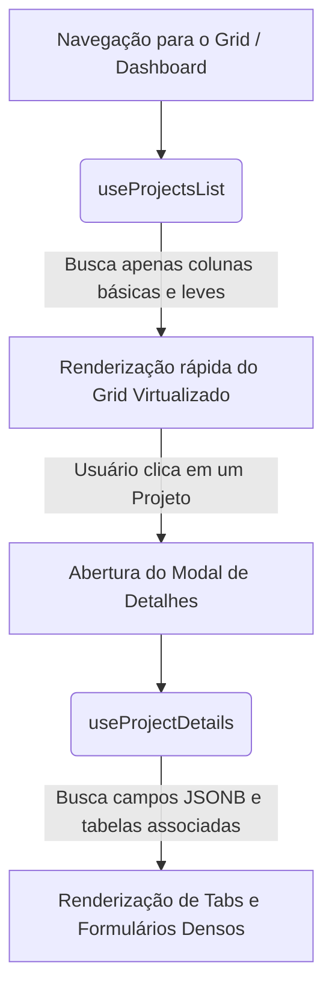

# 🛠️ Manual do Desenvolvedor: Siplan Hub

Bem-vindo ao **Manual do Desenvolvedor** do Siplan Hub. Este documento serve como um guia abrangente para desenvolvedores que necessitam realizar manutenção, correções de bugs ou implementar novas funcionalidades no sistema.

---

## 📑 Índice

1. [Setup do Ambiente de Desenvolvimento](#-setup-do-ambiente-de-desenvolvimento)
2. [Arquitetura da Aplicação](#-arquitetura-da-aplicação)
3. [Modelo de Dados e Banco de Dados (Supabase)](#-modelo-de-dados-e-banco-de-dados-supabase)
4. [Gerenciamento de Estado](#-gerenciamento-de-estado)
5. [Guias de Implementação Passo a Passo](#-guias-de-implementação-passo-a-passo)
6. [Boas Práticas e Padrões de Código](#-boas-práticas-e-padrões-de-código)
7. [Testes e Qualidade de Código](#-testes-e-qualidade-de-código)

---

## 💻 Setup do Ambiente de Desenvolvimento

### Pré-requisitos
* **Node.js**: Versão 18+ (recomendado 20 LTS) ou **Bun** para execução.
* **Supabase CLI**: Opcional, mas recomendado para gerenciamento de migrations locais.
* **Git**: Para controle de versão.

### Passo 1: Clonar e Instalar Dependências
No diretório do projeto, execute:
```bash
# Usando NPM
npm install

# Ou usando Bun (caso prefira)
bun install
```

### Passo 2: Variáveis de Ambiente
Crie um arquivo `.env` na raiz do projeto com as credenciais do Supabase:
```env
VITE_SUPABASE_URL=https://sua-url-do-supabase.supabase.co
VITE_SUPABASE_PUBLISHABLE_KEY=sua-chave-anonima-publica
```
> [!WARNING]
> Nunca envie o arquivo `.env` para o repositório git. Ele já está listado no `.gitignore`.

### Passo 3: Executar em Desenvolvimento
Inicie o servidor de desenvolvimento do Vite:
```bash
npm run dev
```
O sistema abrirá por padrão na porta `5173`. Você pode acessá-lo em `http://localhost:5173`.

---

## 🏛️ Arquitetura da Aplicação

O Siplan Hub segue uma arquitetura baseada em componentes React funcionais estruturados com TypeScript e estilizados de forma utilitária via Tailwind CSS.

### 🧭 Estrutura de Pastas e Responsabilidades

* `src/components`: Componentes desacoplados. Componentes complexos (ex: `ProjectManagement`) são organizados por pastas internas (`Forms`, `Tabs`) para evitar arquivos excessivamente grandes.
* `src/hooks`: Centralização de toda a lógica de comunicação com o Supabase e manipulação de estado do servidor via React Query.
* `src/pages`: Componentes de página mapeados pelo React Router DOM em [App.tsx](file:///d:/AI/siplan-hub/src/App.tsx).
* `src/stores`: Estados globais locais de curta duração gerenciados via Zustand.
* `src/types`: Definições globais de tipos do TypeScript.

### 🔄 Fluxo de Dados e Performance (Split Query)
O gerenciamento dos projetos segue um padrão de otimização de largura de banda e renderização rápida chamado **Split Query**:



* **Leitura Leve (`useProjectsList`)**: Usado no dashboard e na listagem geral. Retorna apenas dados essenciais (`id`, `clientName`, `status`, `healthScore`, etc.) otimizando a paginação baseada em scroll infinito.
* **Leitura Densa (`useProjectDetails`)**: Ativado sob demanda apenas quando o modal ou tela de detalhes é aberta (`enabled: !!projectId`), trazendo campos pesados de notas (`notes`), histórico de auditoria e tabelas associadas.

---

## 🗄️ Modelo de Dados e Banco de Dados (Supabase)

### Estrutura Base de Projetos
A tabela central `projects` armazena todos os metadados dos projetos de implantação. As etapas são salvas na mesma tabela utilizando colunas prefixadas.

As principais etapas e seus prefixos são:
* **Infraestrutura**: `infra_status`, `infra_responsible`, `infra_start_date`, `infra_end_date`, `infra_blocking_reason`, `infra_server_in_use`, `infra_server_needed`, `infra_approved_by_infra`, `infra_technical_notes`, `infra_observations`.
* **Aderência**: `adherence_status`, `adherence_responsible`, `adherence_start_date`, `adherence_end_date`, `adherence_has_product_gap`, `adherence_dev_ticket`, `adherence_dev_estimated_date`, `adherence_analysis_complete`, `adherence_conformity_standards`, `adherence_observations`.
* **Ambiente**: `environment_status`, `environment_responsible`, `environment_real_date`, `environment_os_version`, `environment_version`, `environment_approved_by_infra`, `environment_test_available`, `environment_preparation_checklist`, `environment_observations`.
* **Conversão**: `conversion_status`, `conversion_responsible`, `conversion_complexity`, `conversion_record_count`, `conversion_data_volume_gb`, `conversion_tool_used`, `conversion_homologation_complete`, `conversion_homologation_date`, `conversion_deviations`, `conversion_observations`.
* **Modelos Editor**: `modelos_editor_status`, `modelos_editor_responsible`, `modelos_editor_start_date`, `modelos_editor_end_date`, `modelos_editor_observations`, `modelos_editor_sent_files` (JSONB), `modelos_editor_available_files` (JSONB).
* **Implantação**: `implementation_status`, `implementation_responsible`, `implementation_remote_install_date`, `implementation_training_start_date`, `implementation_training_end_date`, `implementation_switch_type`, `implementation_switch_start_time`, `implementation_switch_end_time`, `implementation_training_type`, `implementation_training_location`, `implementation_participants_count`, `implementation_client_feedback`, `implementation_acceptance_status`, `implementation_observations`.
* **Pós-Implantação**: `post_status`, `post_responsible`, `post_start_date`, `post_end_date`, `post_support_period_days`, `post_support_end_date`, `post_benefits_delivered`, `post_challenges_found`, `post_roi_estimated`, `post_client_satisfaction`, `post_recommendations`, `post_followup_needed`, `post_followup_date`, `post_observations`.

### Sincronização de Tipos (TypeScript)
Os tipos do banco de dados no Supabase são mapeados no arquivo [types.ts](file:///d:/AI/siplan-hub/src/integrations/supabase/types.ts). Caso altere o schema do banco, você pode regenerar esses tipos executando:
```bash
npx supabase gen types typescript --project-id <id-do-projeto> > src/integrations/supabase/types.ts
```

### Segurança: RLS e RBAC
* **RLS (Row Level Security)**: Todas as tabelas têm o RLS ativado. As políticas devem ser tratadas com cautela para garantir que apenas usuários autorizados tenham privilégios de escrita (`INSERT`, `UPDATE`, `DELETE`).
* **RBAC (Role-Based Access Control)**: O controle de acesso a menus e botões é gerenciado pelo hook customizado `usePermissions`, que verifica se o usuário autenticado possui as permissões necessárias registradas na tabela `profiles` ou no banco para o recurso acessado.

---

## 🧠 Gerenciamento de Estado

### TanStack React Query (Estado do Servidor)
* Usado para cachear os dados vindos da API do Supabase.
* **Mutações**: Sempre que alterar um dado (ex: atualizar o status de uma etapa ou inserir um checklist), lembre-se de invalidar as chaves de query afetadas para forçar o React Query a buscar a versão mais recente.
  ```typescript
  const queryClient = useQueryClient();
  // Exemplo de invalidação após mutação com sucesso:
  queryClient.invalidateQueries({ queryKey: ["projectsList"] });
  queryClient.invalidateQueries({ queryKey: ["projectDetails", projectId] });
  ```

### Zustand (Estado Local da UI)
* Usado para comportamentos rápidos da interface que não necessitam persistência direta no banco de dados a cada interação.
* **`calendarStore`**: Controla as datas selecionadas, visualizações ativas (mês/semana) e os estados temporários de arraste de eventos (Ghost State).
* **`filterStore`**: Controla filtros rápidos aplicados pelo usuário à listagem de projetos.

### ⚓ Hooks Especiais de Lógica e Comunicação

#### 1. Sistema de Notificações em Tempo Real (`useNotifications`)
* **Arquivo**: [useNotifications.ts](file:///d:/AI/siplan-hub/src/hooks/useNotifications.ts)
* **Como funciona**: Além de buscar as notificações normais do banco de dados filtrando por usuário ou equipe (`TeamArea`), ele se inscreve no canal PostgreSQL do Supabase (`postgres_changes` na tabela `notifications` com evento `INSERT`).
* **Uso**: Atualiza dinamicamente o número no `NotificationBell` sem a necessidade de polling HTTP periódico.

#### 2. Autosave com Retry e Unmount Save (`useAutoSave`)
* **Arquivo**: [useAutoSave.ts](file:///d:/AI/siplan-hub/src/hooks/useAutoSave.ts)
* **Como funciona**:
  - **Debounce**: Apenas dispara o callback `onSave` após `500ms` da última alteração de dados do usuário (previne concorrência de escritas no banco).
  - **Tentativas (Retry)**: Caso a gravação falhe por oscilação na rede, o hook tenta salvar automaticamente até 3 vezes antes de marcar o status como erro.
  - **Salvamento no Desmonte (Unmount)**: No desmonte do componente (por exemplo, ao trocar de aba no formulário), se houverem alterações locais pendentes não salvas pelo debounce, ele executa um salvamento imediato e síncrono.

---

## 🚀 Guias de Implementação Passo a Passo

### Como adicionar um novo campo customizado ao formulário do projeto
Para estender o modelo de dados adicionando um novo campo à ficha técnica do projeto, siga estes passos:

1. **Adicionar coluna no Banco de Dados (Supabase)**:
   Crie uma nova migration em `supabase/migrations/` ou execute o comando SQL direto no painel:
   ```sql
   ALTER TABLE public.projects ADD COLUMN infra_novo_campo TEXT;
   ```
2. **Atualizar Tipos do TypeScript**:
   * Atualize o arquivo [types.ts](file:///d:/AI/siplan-hub/src/integrations/supabase/types.ts) rodando o CLI ou manualmente.
   * Adicione o novo campo na interface correspondente em [ProjectV2.ts](file:///d:/AI/siplan-hub/src/types/ProjectV2.ts) (ex: dentro do `InfraStageV2`).
3. **Atualizar Mapeamento de Linha (Transformer)**:
   * Edite o arquivo [project-transformers.ts](file:///d:/AI/siplan-hub/src/utils/project-transformers.ts) para mapear o campo vindo do banco de dados na resposta do Supabase para o objeto tipado em `ProjectV2`.
4. **Inserir no Formulário Visual**:
   * Adicione o componente de input (ex: `Input`, `Select`, `Switch`) correspondente dentro da aba do estágio do projeto (localizados em `src/components/ProjectManagement/Forms/`).
5. **Configurar o Auto-save**:
   * Verifique se o formulário em questão consome o hook `useProjectForm`, que escuta alterações nos campos e faz o salvamento via mutação com debounce.

---

## 🎨 Boas Práticas e Padrões de Código

### 1. Prevenção de "Event Clipping" no Calendário
Ao editar o arquivo `CalendarGrid.tsx` ou implementar lógicas de datas de agendamentos:
* **NUNCA** renderize elementos de evento dentro do loop de renderização das células dos dias.
* Siga estritamente a **Arquitetura de 3 Camadas** (Background Grid `z-0`, Droppable Zone `z-10` e Events Layer `z-20`).
* Garanta que o container de eventos na camada superior tenha a classe CSS `pointer-events-none` e que apenas os cartões de eventos em si tenham `pointer-events-auto`, permitindo cliques e drag & drop sem bloquear a grade de baixo.

### 2. Padrão de Estilização Shadcn + Tailwind
* Utilize as cores definidas pelo tema da aplicação no [tailwind.config.ts](file:///d:/AI/siplan-hub/tailwind.config.ts) (como `primary`, `secondary`, `accent`, etc.) em vez de classes de cores fixas (como `bg-red-500`), garantindo o suporte dinâmico ao Dark Mode / Light Mode.
* Use o utilitário `cn(...)` importado de `@/lib/utils` para mesclar condicionalmente classes de estilização Tailwind.

### 3. Evitar Bloqueios de UI em Listagens (Virtualização)
* Ao criar ou refatorar listagens que possam conter centenas de elementos, utilize a biblioteca `react-virtuoso` ou `react-window` já configuradas no projeto.
* Isso garante que o navegador renderize apenas os elementos visíveis no visor (viewport), prevenindo lentidões extremas.

---

## 🧪 Testes e Qualidade de Código

### Rodando Testes Unitários
O projeto utiliza o **Vitest** como framework de testes rápidos.
Para rodar os testes existentes:
```bash
npm run test
```

### Checklist Visual (QA)
Antes de abrir um pull request, verifique a conformidade visual descrita em [VISUAL_QA.md](file:///d:/AI/siplan-hub/VISUAL_QA.md):
* **Tipografia**: Títulos e cabeçalhos devem usar fonte Sans-serif com `tracking-tight`.
* **Arredondamento (Radius)**: Os cantos de cartões e botões padrão devem usar `0.5rem` (`rounded-lg` / 8px).
* **Sombras**: Cards padrão devem usar sombras sutis (`shadow-subtle`), reservando sombras em camadas (`shadow-layered`) apenas para diálogos, popovers ou barras flutuantes.
* **Componentes de Ação**: Botões de contorno (outline) e secundários não devem ter fundo cinza por padrão.
