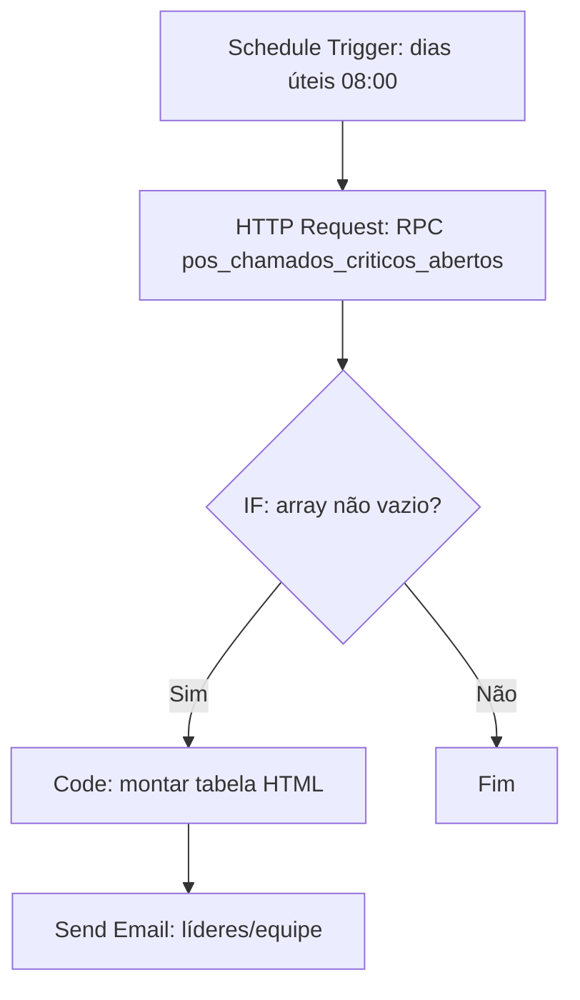

# 🚨 Guia Passo a Passo: Alertas do Pós-Implantação (chamados 0800) — Siplan HUB

Duas automações agendadas no **n8n** sobre o espelho `chamados_0800` (sincronizado pelo vm-worker a partir do Ellevo):

1. **Crítico parado no pós** — chamado com criticidade "Crítico" em aberto há N+ dias dentro da janela de pós de algum projeto → e-mail para a equipe/líder.
2. **Tema recorrente na carteira** — tema (IA) presente em N+ cartórios nos últimos X dias → alerta para o time de produto.

Ambas usam **RPCs prontas no Supabase** (migration `20260716210000_panorama_parecer_e_alertas.sql`) — o n8n só chama a função e formata o e-mail. Sem SQL no n8n.

---

## 📋 1. Descrição Geral do Fluxo

Padrão B (polling agendado): Schedule Trigger diário → HTTP Request na RPC do Supabase → IF (tem linhas?) → e-mail.



---

## 🛠️ 2. RPCs disponíveis (já aplicadas no banco)

### `pos_chamados_criticos_abertos(p_dias int default 3)`
Retorna chamados **críticos, em aberto, dentro da janela de pós** (cliente via chamado de origem + produto + período) há `p_dias`+ dias:
`numero_chamado, cliente, produto, titulo, criticidade, dias_aberto, data_abertura, projeto_id, lider`.

Teste no SQL Editor:
```sql
select * from public.pos_chamados_criticos_abertos(3);
```

### `pos_temas_recorrentes(p_min_cartorios int default 3, p_dias int default 30)`
Temas IA presentes em `p_min_cartorios`+ cartórios nos últimos `p_dias` dias:
`tema, chamados, cartorios, nomes[]`.

```sql
select * from public.pos_temas_recorrentes(3, 30);
```

---

## ⚙️ 3. Configuração no n8n — Automação 1 (crítico parado)

1. **Schedule Trigger**: Cron `0 8 * * 1-5` (dias úteis, 08:00).
2. **HTTP Request**:
   - Method: `POST`
   - URL: `https://okvufcwkophaadttmjwa.supabase.co/rest/v1/rpc/pos_chamados_criticos_abertos`
   - Headers: `apikey: <SERVICE_KEY>`, `Authorization: Bearer <SERVICE_KEY>`, `Content-Type: application/json`
   - Body (JSON): `{ "p_dias": 3 }`
   - (Use a credencial de service key já cadastrada no n8n para o Supabase; nunca a anon.)
3. **IF**: `{{ $json.length }}` → `Number` → `larger` → `0`.
4. **Code** (montar linhas):
   ```javascript
   const rows = $input.first().json;
   const linhas = rows.map(r =>
     `<tr><td>#${r.numero_chamado}</td><td>${r.cliente}</td><td>${r.produto}</td>` +
     `<td>${r.titulo ?? ""}</td><td style="text-align:center;font-weight:bold;color:#ad0505;">${r.dias_aberto} dias</td></tr>`
   ).join("");
   return [{ json: { linhas, total: rows.length } }];
   ```
5. **Send Email**: assunto `⚠️ SiplanHUB — {{ $json.total }} chamado(s) CRÍTICO(S) parados no pós-implantação`. Corpo: use o template padrão bordeaux (#ad0505) dos manuais desta pasta, com a tabela `{{ $json.linhas }}` e o bloco "🎯 A BOLA ESTÁ COM VOCÊ — PRÓXIMOS PASSOS:" apontando para a aba **Análise Pós-Implantação** do projeto (`https://hub.siplan.com.br/projects/<projeto_id>`).

## ⚙️ 4. Configuração no n8n — Automação 2 (tema recorrente)

Igual à 1, trocando:
- Cron: `0 8 * * 1` (segunda-feira, visão semanal).
- URL da RPC: `.../rest/v1/rpc/pos_temas_recorrentes` com body `{ "p_min_cartorios": 3, "p_dias": 30 }`.
- E-mail para o **time de produto**: assunto `📊 SiplanHUB — temas recorrentes no pós ({{ $json.total }})`, tabela `tema | cartórios | chamados` e a lista de cartórios (`nomes`).

---

## 🧪 5. Teste seguro

As RPCs são somente leitura (STABLE) — pode rodar à vontade no SQL Editor. Para simular o disparo sem esperar o cron, use "Execute Workflow" no n8n com as RPCs de teste acima; nenhum dado é alterado.
