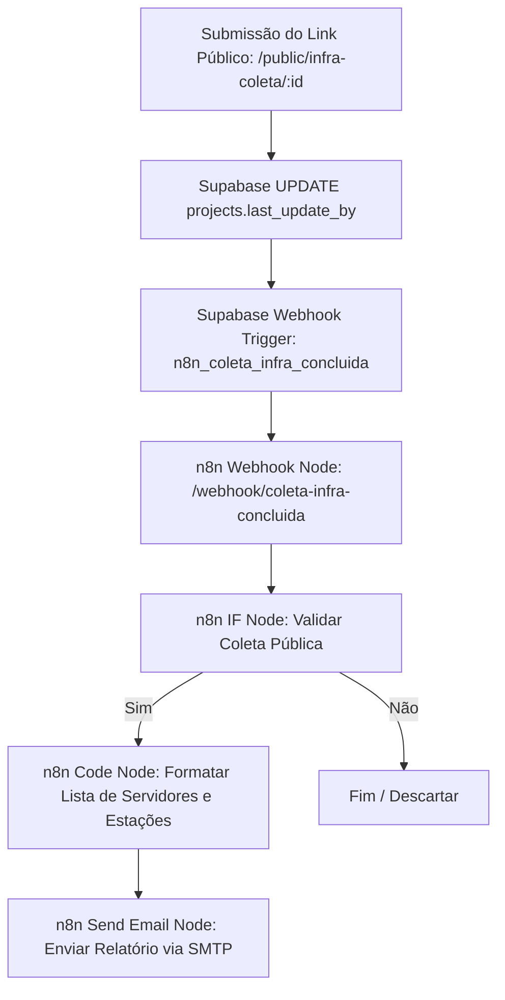

# 🚀 Guia Passo a Passo: Automação de Notificação de Coleta de Infraestrutura — Siplan HUB

Este manual técnico orienta a criação, configuração e implantação no **n8n** integrada ao **Supabase** e **SMTP/Gmail**, com o objetivo de notificar a equipe de infraestrutura e implantação assim que o técnico do cartório finalizar e submeter os dados de infraestrutura pelo link público (`/public/infra-coleta/:id`).

A automação envia um e-mail estruturado em HTML premium contendo o resumo consolidado do **Status do Servidor**, **Status das Estações**, número de máquinas analisadas e o parecer geral (Finalizado ou Bloqueado).

---

## 📋 1. Descrição Geral do Fluxo

Quando o técnico do cartório submete o formulário no link público, o sistema executa a RPC `update_project_public_infra` no Supabase, gravando o campo `last_update_by = 'Coleta Pública (Técnico)'` e atualizando os status `infra_status`, `infra_server_status` e `infra_workstations_status`.

O gatilho do Supabase intercepta essa alteração e faz um disparo HTTP POST para o webhook do n8n, que gera e envia a notificação por e-mail.



---

## 🛠️ 2. Configuração do Webhook no Supabase (Trigger)

O trigger condicional já foi aplicado no banco de dados Supabase via migration:

### Script de Criação (Migration Aplicada):
```sql
-- Migration: Adicionar trigger n8n para finalização/envio da coleta pública de infraestrutura

DROP TRIGGER IF EXISTS n8n_coleta_infra_concluida ON public.projects;

CREATE TRIGGER n8n_coleta_infra_concluida
  AFTER UPDATE ON public.projects
  FOR EACH ROW
  WHEN (
    NEW.last_update_by = 'Coleta Pública (Técnico)'
    AND (OLD.last_update_by IS DISTINCT FROM 'Coleta Pública (Técnico)')
  )
  EXECUTE FUNCTION supabase_functions.http_request(
    'http://n8n.siplan.com.br:5678/webhook/coleta-infra-concluida', 
    'POST', 
    '{"Content-type":"application/json"}', 
    '{}', 
    '5000'
  );
```

### Configurações no Painel do Supabase (para validação visual):
* **Name:** `n8n_coleta_infra_concluida`
* **Table:** `projects`
* **Events:** `UPDATE`
* **URL:**
  * *Teste:* `http://n8n.siplan.com.br:5678/webhook-test/coleta-infra-concluida`
  * *Produção:* `http://n8n.siplan.com.br:5678/webhook/coleta-infra-concluida`
* **HTTP Method:** `POST`
* **Headers:** `Content-Type: application/json`

---

## ⚙️ 3. Configuração Passo a Passo dos Nós no n8n

O fluxo no n8n é composto por **4 nós funcionais**:

### Nó 1: Webhook (Gatilho)
* **Name:** `Webhook - Coleta Infra Concluída`
* **HTTP Method:** `POST`
* **Path:** `coleta-infra-concluida`
* **Response Mode:** `onReceived` (Response Code 200)

### Nó 2: IF (Filtro de Validação)
* **Name:** `IF - É Coleta Pública?`
* **Conditions (Combinador):** `AND`
* **Condição (String):**
  * **Value 1:** `{{ $json.body.record.last_update_by }}`
  * **Operation:** `Equal`
  * **Value 2:** `Coleta Pública (Técnico)`

### Nó 3: Code (Formatador dos Dados em HTML)
Nó do tipo JavaScript para montar a listagem legível dos servidores e das máquinas coletadas:
* **Name:** `Code - Formatar HTML das Máquinas`
* **Language:** `JavaScript`
* **Code:**
```javascript
const record = $input.item.json.body.record;

const servers = record.infra_servers || [];
const workstations = record.infra_workstations || [];

let serversHtml = '';
if (servers.length === 0) {
  serversHtml = '<tr><td colspan="4" style="padding: 10px; color: #94a3b8; font-style: italic;">Nenhum servidor cadastrado.</td></tr>';
} else {
  servers.forEach(srv => {
    serversHtml += `
      <tr style="border-bottom: 1px solid #f1f5f9;">
        <td style="padding: 10px; font-weight: bold; color: #0f172a;">${srv.hostname || 'SERVIDOR'}</td>
        <td style="padding: 10px; color: #475569;">${srv.processor || '-'}</td>
        <td style="padding: 10px; color: #475569;">${srv.memory || '-'} RAM</td>
        <td style="padding: 10px; color: #475569;">${srv.os || '-'}</td>
      </tr>`;
  });
}

let workstationsSummary = `Estações Coletadas: ${workstations.length} máquina(s) declarada(s).`;

return {
  json: {
    ...$input.item.json,
    formatted_servers_html: serversHtml,
    workstations_summary: workstationsSummary,
    infra_status_badge: record.infra_status === 'blocked' 
      ? '<span style="background-color: #fef2f2; color: #dc2626; border: 1px solid #fecaca; padding: 4px 12px; border-radius: 50px; font-size: 11px; font-weight: bold; text-transform: uppercase;">🔴 BLOQUEADO (INADEQUAÇÕES)</span>'
      : '<span style="background-color: #ecfdf5; color: #059669; border: 1px solid #a7f3d0; padding: 4px 12px; border-radius: 50px; font-size: 11px; font-weight: bold; text-transform: uppercase;">🟢 INFRAESTRUTURA FINALIZADA</span>'
  }
};
```

### Nó 4: Send Email (SMTP)
* **Name:** `Email - Notificação de Coleta Concluída`
* **To Email:** `marcus.vinicius@siplan.com.br, hugo.santariosi@siplan.com.br, bruno.fernandes@siplan.com.br, alex.silva@siplan.com.br`
* **Subject:** `🖥️ [SIPLAN HUB] Coleta de Infra Recebida — {{ $json.body.record.client_name }} (#{{ $json.body.record.ticket_number }})`
* **Format:** `HTML`
* **Body (HTML):** *(Utilizar o template HTML da Seção 4 abaixo)*

---

## ✉️ 4. Modelo do E-mail (HTML Premium)

```html
<!DOCTYPE html>
<html lang="pt-BR">
<head>
  <meta charset="UTF-8">
  <meta name="viewport" content="width=device-width, initial-scale=1.0">
  <title>Coleta de Infraestrutura Recebida</title>
</head>
<body style="margin: 0; padding: 0; background-color: #f8fafc; font-family: 'Segoe UI', -apple-system, BlinkMacSystemFont, Roboto, Helvetica, Arial, sans-serif; color: #1e293b; line-height: 1.6;">
  <table width="100%" border="0" cellspacing="0" cellpadding="0" style="background-color: #f8fafc; padding: 20px 40px;">
    <tr>
      <td align="center">
        <table width="100%" border="0" cellspacing="0" cellpadding="0" style="background-color: #ffffff; border-radius: 12px; overflow: hidden; box-shadow: 0 10px 15px -3px rgba(15, 23, 42, 0.05), 0 4px 6px -2px rgba(15, 23, 42, 0.05); border: 1px solid #e2e8f0; max-width: 650px;">
          
          <!-- Cabeçalho -->
          <tr>
            <td style="background-color: #0f172a; padding: 28px 40px; text-align: left;">
              <span style="color: #ad0505; font-size: 11px; font-weight: bold; text-transform: uppercase; letter-spacing: 2px; display: block; margin-bottom: 4px;">INFRAESTRUTURA TÉCNICA</span>
              <h1 style="color: #ffffff; font-size: 22px; margin: 0; font-weight: 800; letter-spacing: -0.5px;">SIPLAN <span style="color: #ad0505;">HUB</span></h1>
            </td>
          </tr>
          
          <!-- Linha Decorativa Vermelha -->
          <tr>
            <td height="4" style="background-color: #ad0505; line-height: 4px; font-size: 4px;">&nbsp;</td>
          </tr>

          <!-- Corpo do E-mail -->
          <tr>
            <td style="padding: 40px 40px;">
              
              <!-- Status Badge -->
              <table border="0" cellspacing="0" cellpadding="0" style="margin-bottom: 20px;">
                <tr>
                  <td>
                    {{{ $json.infra_status_badge }}}
                  </td>
                </tr>
              </table>

              <h2 style="color: #0f172a; font-size: 20px; margin-top: 0; margin-bottom: 12px; font-weight: 700; letter-spacing: -0.3px;">Dados de Infraestrutura Recebidos!</h2>
              <p style="font-size: 15px; color: #475569; margin-bottom: 20px;">
                O técnico do cartório finalizou a coleta e enviou os arquivos de inventário pelo link público.
              </p>
              
              <!-- Card de Resumo do Projeto -->
              <table width="100%" border="0" cellspacing="0" cellpadding="12" style="background-color: #f8fafc; border-radius: 8px; margin: 20px 0; border: 1px solid #e2e8f0; border-left: 4px solid #ad0505; font-size: 13px;">
                <tr>
                  <td width="30%" style="font-weight: bold; color: #64748b; text-transform: uppercase; font-size: 11px;">Cliente:</td>
                  <td style="color: #1e293b; font-weight: 700;">{{ $json.body.record.client_name }}</td>
                </tr>
                <tr>
                  <td style="font-weight: bold; color: #64748b; text-transform: uppercase; font-size: 11px;">Nº Chamado:</td>
                  <td style="color: #1e293b; font-weight: 600;">#{{ $json.body.record.ticket_number }}</td>
                </tr>
                <tr>
                  <td style="font-weight: bold; color: #64748b; text-transform: uppercase; font-size: 11px;">Sistema:</td>
                  <td style="color: #ad0505; font-weight: bold;">{{ $json.body.record.system_type }}</td>
                </tr>
                <tr>
                  <td style="font-weight: bold; color: #64748b; text-transform: uppercase; font-size: 11px;">Status Servidor:</td>
                  <td style="color: #1e293b; font-weight: bold;">{{ $json.body.record.infra_server_status || 'Aguardando Avaliação' }}</td>
                </tr>
                <tr>
                  <td style="font-weight: bold; color: #64748b; text-transform: uppercase; font-size: 11px;">Status Estações:</td>
                  <td style="color: #1e293b; font-weight: bold;">{{ $json.body.record.infra_workstations_status || 'Aguardando Avaliação' }}</td>
                </tr>
              </table>

              <!-- Tabela de Servidores Coletados -->
              <h3 style="color: #0f172a; font-size: 14px; margin-top: 25px; margin-bottom: 10px; font-weight: bold;">🖥️ Servidor(es) Detectado(s):</h3>
              <table width="100%" border="0" cellspacing="0" cellpadding="0" style="border: 1px solid #e2e8f0; border-radius: 6px; font-size: 12px; text-align: left; background-color: #ffffff;">
                <thead>
                  <tr style="background-color: #f1f5f9; color: #475569; font-weight: bold;">
                    <th style="padding: 8px 10px;">Hostname</th>
                    <th style="padding: 8px 10px;">Processador</th>
                    <th style="padding: 8px 10px;">RAM</th>
                    <th style="padding: 8px 10px;">S.O.</th>
                  </tr>
                </thead>
                <tbody>
                  {{{ $json.formatted_servers_html }}}
                </tbody>
              </table>

              <!-- Resumo das Estações -->
              <p style="font-size: 13px; color: #475569; margin-top: 15px; background-color: #f8fafc; padding: 10px 14px; border-radius: 6px; border: 1px solid #e2e8f0;">
                💻 <strong>Estações de Trabalho:</strong> {{ $json.workstations_summary }}
              </p>

              <!-- Bloco A Bola Está com Você -->
              <table width="100%" border="0" cellspacing="0" cellpadding="0" style="background-color: #fff5f5; border-radius: 8px; border: 1px dashed #feb2b2; margin-top: 25px; padding: 25px; text-align: left;">
                <tr>
                  <td>
                    <h3 style="color: #ad0505; font-size: 14px; margin: 0 0 12px 0; font-weight: bold; text-transform: uppercase; letter-spacing: 0.5px;">
                      🎯 A BOLA ESTÁ COM VOCÊ — PRÓXIMOS PASSOS:
                    </h3>
                    <ul style="margin: 0; padding-left: 20px; color: #475569; font-size: 13px; line-height: 1.8;">
                      <li style="margin-bottom: 8px;"><strong style="color: #475569;">🔍 Revisão Técnica:</strong> Abrir o projeto no Siplan HUB e conferir os alertas da planilha de hardware.</li>
                      <li style="margin-bottom: 8px;"><strong style="color: #475569;">📄 Relatório Analítico:</strong> Gerar o PDF de Análise Técnica se necessário.</li>
                      <li style="margin-bottom: 0;"><strong style="color: #ad0505;">🔴 CASO INADEQUADO:</strong> Se a infraestrutura estiver Bloqueada, notificar o Comercial e a TI do cartório com a lista de adequações requeridas.</li>
                    </ul>
                  </td>
                </tr>
              </table>

              <!-- Botão Acessar Projeto -->
              <table width="100%" border="0" cellspacing="0" cellpadding="0" style="margin-top: 30px;">
                <tr>
                  <td align="center">
                    <a href="https://hub.siplan.com.br/projects/{{ $json.body.record.id }}" style="background-color: #ad0505; color: #ffffff; padding: 14px 35px; text-decoration: none; border-radius: 6px; font-weight: bold; font-size: 14px; display: inline-block; box-shadow: 0 4px 6px -1px rgba(173, 5, 5, 0.2); text-transform: uppercase; letter-spacing: 0.5px;">Ver Infraestrutura no HUB</a>
                  </td>
                </tr>
              </table>

            </td>
          </tr>

          <!-- Rodapé -->
          <tr>
            <td style="background-color: #f8fafc; padding: 25px 40px; text-align: center; font-size: 11px; color: #94a3b8; border-top: 1px solid #f1f5f9;">
              E-mail gerado automaticamente pelo orquestrador do Siplan HUB.<br>
              Por favor, não responda a este e-mail.
            </td>
          </tr>

        </table>
      </td>
    </tr>
  </table>
</body>
</html>
```

---

## 🧪 5. Scripts de Simulação e Testes (Supabase)

Para testar a automação no Supabase e no n8n:

```sql
BEGIN;

-- Simula o envio público de dados por um técnico
UPDATE public.projects 
SET 
  infra_server_status = 'Adequado',
  infra_workstations_status = 'Adequado',
  last_update_by = 'Coleta Pública (Técnico)'
WHERE id = (SELECT id FROM public.projects WHERE is_deleted = false LIMIT 1);

-- Verifica o log de hooks executados pelo trigger
SELECT * FROM supabase_functions.hooks 
WHERE hook_name = 'n8n_coleta_infra_concluida' 
ORDER BY created_at DESC 
LIMIT 1;

ROLLBACK;
```
