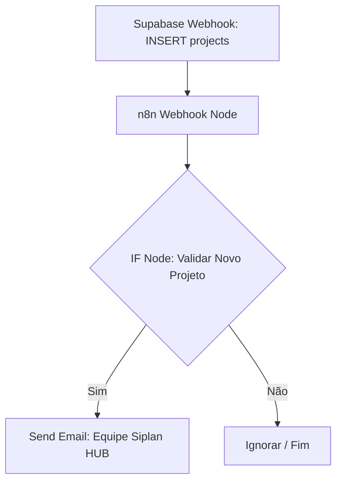

# 🚀 Guia Passo a Passo: Automação de Novo Projeto Criado (0800) — Siplan HUB

Este manual técnico orienta a criação, configuração e implantação manual de uma automação no **n8n** integrada ao **Supabase** e **Gmail SMTP**, com o objetivo de notificar a equipe responsável quando um novo projeto for criado (evento `INSERT` na tabela `projects`) através do chamado do tipo "0800" no Siplan HUB.

A automação foi ajustada para filtrar e ignorar os projetos do sistema **"Modelos TN"** (ou limitar apenas aos sistemas desejados: `Orion TN`, `Orion PRO`, `Orion REG` e `WEB RI`), evitando disparos desnecessários de e-mails para a equipe técnica.

---

## 📋 1. Descrição Geral do Fluxo

O fluxo é ativado por um Database Webhook no Supabase que monitora inserções na tabela `projects`. Quando um novo projeto é cadastrado, os dados dele são enviados ao n8n. O n8n então valida o payload através de um nó **IF** antes de enviar a notificação por e-mail.



---

## 🛠️ 2. Configuração do Webhook no Supabase (Trigger)

Para enviar os novos projetos ao n8n, o webhook é configurado no painel do Supabase (ou via script SQL) apontando para o endpoint do n8n:

### Script de Criação do Trigger (Referência):
```sql
-- Migration/Script: Adicionar trigger n8n para novo projeto 0800
DROP TRIGGER IF EXISTS n8n_novo_projeto_0800 ON public.projects;

CREATE TRIGGER n8n_novo_projeto_0800
  AFTER INSERT ON public.projects
  FOR EACH ROW
  EXECUTE FUNCTION supabase_functions.http_request(
    'http://n8n.siplan.com.br:5678/webhook/novo-projeto-0800', 
    'POST', 
    '{"Content-type":"application/json"}', 
    '{}', 
    '5000'
  );
```

### Configurações no Painel do Supabase:
*   **Name:** `n8n_novo_projeto_0800`
*   **Table:** `projects`
*   **Events:** Selecionar apenas **Insert**
*   **Method:** `POST`
*   **URL:** `http://n8n.siplan.com.br:5678/webhook/novo-projeto-0800`
*   **Headers:**
    *   *Key:* `Content-Type`
    *   *Value:* `application/json`

---

## ⚙️ 3. Configuração Passo a Passo do Nó IF no n8n

O nó IF é responsável por filtrar as requisições válidas. A seguir, detalhamos as duas alternativas de filtragem possíveis. Escolha a que melhor se adapta à sua política de novos sistemas:

### Opção A: Excluir apenas "Modelos TN" (Recomendada e mais simples)
Esta opção é ideal porque permite que novos sistemas criados futuramente continuem disparando a automação automaticamente, barrando apenas o sistema de Modelos.

*   **Combinador (Logical Connection):** `AND`
*   *Condição 1 (Tipo: String):*
    *   **Value 1:** `{{ $json.body.type }}`
    *   **Operation:** `Equal`
    *   **Value 2:** `INSERT`
*   *Condição 2 (Tipo: String):*
    *   **Value 1:** `{{ $json.body.record.ticket_number }}`
    *   **Operation:** `Is Not Empty`
*   *Condição 3 (Tipo: String):*
    *   **Value 1:** `{{ $json.body.record.system_type }}`
    *   **Operation:** `Not Equal`
    *   **Value 2:** `Modelos TN`

#### Código JSON da Opção A para colar no n8n:
Selecione e copie o JSON abaixo, depois pressione `Ctrl+V` dentro do canvas do seu n8n:
```json
{
  "parameters": {
    "conditions": {
      "options": {
        "caseSensitive": true,
        "leftValue": "",
        "type": "string"
      },
      "conditions": [
        {
          "id": "c1f7360e-89a3-4927-9c98-1a5c4e09f4ba",
          "leftValue": "={{ $json.body.type }}",
          "rightValue": "INSERT",
          "operator": "equals",
          "type": "string"
        },
        {
          "id": "e4f8d951-683a-4efb-88a4-569d6715f10b",
          "leftValue": "={{ $json.body.record.ticket_number }}",
          "operator": "isNotEmpty",
          "type": "string"
        },
        {
          "id": "d0e2e2a8-12c8-47bb-a968-07f9c2d1b821",
          "leftValue": "={{ $json.body.record.system_type }}",
          "rightValue": "Modelos TN",
          "operator": "notEquals",
          "type": "string"
        }
      ],
      "combinator": "and"
    }
  },
  "id": "if-filter-novo-projeto",
  "name": "IF - Validar Novo Projeto (Sem Modelos TN)",
  "type": "n8n-nodes-base.if",
  "typeVersion": 2.2,
  "position": [
    250,
    300
  ]
}
```

---

### Opção B: Filtro Estrito (Apenas Orion TN, Orion PRO, Orion REG e WEB RI)
Esta opção é mais restritiva e garante que **apenas** os sistemas listados acionem a automação. Qualquer outro tipo de sistema cadastrado será ignorado.

*   **Combinador (Logical Connection):** `AND`
*   *Condição 1 (Tipo: String):*
    *   **Value 1:** `{{ $json.body.type }}`
    *   **Operation:** `Equal`
    *   **Value 2:** `INSERT`
*   *Condição 2 (Tipo: String):*
    *   **Value 1:** `{{ $json.body.record.ticket_number }}`
    *   **Operation:** `Is Not Empty`
*   *Condição 3 (Tipo: Boolean):*
    *   **Value 1:** `{{ ['Orion TN', 'Orion PRO', 'Orion REG', 'WEB RI'].includes($json.body.record.system_type) }}`
    *   **Operation:** `Equal`
    *   **Value 2:** `true`

#### Código JSON da Opção B para colar no n8n:
Selecione e copie o JSON abaixo, depois pressione `Ctrl+V` dentro do canvas do seu n8n:
```json
{
  "parameters": {
    "conditions": {
      "options": {
        "caseSensitive": true,
        "leftValue": "",
        "type": "string"
      },
      "conditions": [
        {
          "id": "c1f7360e-89a3-4927-9c98-1a5c4e09f4ba",
          "leftValue": "={{ $json.body.type }}",
          "rightValue": "INSERT",
          "operator": "equals",
          "type": "string"
        },
        {
          "id": "e4f8d951-683a-4efb-88a4-569d6715f10b",
          "leftValue": "={{ $json.body.record.ticket_number }}",
          "operator": "isNotEmpty",
          "type": "string"
        },
        {
          "id": "b3e0c0df-8bfb-4d43-987d-419b4cf5ab3e",
          "leftValue": "={{ ['Orion TN', 'Orion PRO', 'Orion REG', 'WEB RI'].includes($json.body.record.system_type) }}",
          "rightValue": "true",
          "operator": "true",
          "type": "boolean"
        }
      ],
      "combinator": "and"
    }
  },
  "id": "if-filter-novo-projeto-strict",
  "name": "IF - Validar Novo Projeto (Filtro Estrito)",
  "type": "n8n-nodes-base.if",
  "typeVersion": 2.2,
  "position": [
    250,
    300
  ]
}
```

---

## ✉️ 4. Modelo do E-mail (HTML Premium)

Abaixo está o modelo de e-mail premium para notificação de novos projetos, formatado com as cores e estilo do Siplan HUB (Bordeaux Red `#ad0505`).

```html
<!DOCTYPE html>
<html lang="pt-BR">
<head>
  <meta charset="UTF-8">
  <meta name="viewport" content="width=device-width, initial-scale=1.0">
  <title>Novo Projeto Cadastrado — Siplan HUB</title>
</head>
<body style="margin: 0; padding: 0; background-color: #f8fafc; font-family: 'Segoe UI', -apple-system, BlinkMacSystemFont, Roboto, Helvetica, Arial, sans-serif; color: #1e293b; line-height: 1.6;">
  <table width="100%" border="0" cellspacing="0" cellpadding="0" style="background-color: #f8fafc; padding: 20px 40px;">
    <tr>
      <td align="center">
        <table width="100%" border="0" cellspacing="0" cellpadding="0" style="background-color: #ffffff; border-radius: 12px; overflow: hidden; box-shadow: 0 10px 15px -3px rgba(15, 23, 42, 0.05), 0 4px 6px -2px rgba(15, 23, 42, 0.05); border: 1px solid #e2e8f0; max-width: 650px;">
          <!-- Cabeçalho -->
          <tr>
            <td style="background-color: #0f172a; padding: 28px 40px; text-align: left;">
              <span style="color: #ad0505; font-size: 11px; font-weight: bold; text-transform: uppercase; letter-spacing: 2px; display: block; margin-bottom: 4px;">NOVO PROJETO CADASTRADO</span>
              <h1 style="color: #ffffff; font-size: 22px; margin: 0; font-weight: 800; letter-spacing: -0.5px;">SIPLAN <span style="color: #ad0505;">HUB</span></h1>
            </td>
          </tr>
          <!-- Linha Decorativa Vermelha -->
          <tr>
            <td height="4" style="background-color: #ad0505; line-height: 4px; font-size: 4px;">&nbsp;</td>
          </tr>
          <!-- Corpo do E-mail -->
          <tr>
            <td style="padding: 40px 40px;">
              <!-- Badge de Alerta -->
              <table border="0" cellspacing="0" cellpadding="0" style="margin-bottom: 25px;">
                <tr>
                  <td>
                    <span style="background-color: #f0fdf4; color: #15803d; border: 1px solid #bbf7d0; padding: 6px 14px; border-radius: 50px; font-size: 12px; font-weight: 700; text-transform: uppercase; letter-spacing: 0.5px; display: inline-block;">
                      🆕 NOVO PROJETO DETECTADO (0800)
                    </span>
                  </td>
                </tr>
              </table>

              <h2 style="color: #0f172a; font-size: 20px; margin-top: 0; margin-bottom: 12px; font-weight: 700; letter-spacing: -0.3px;">Novo Projeto Cadastrado via Chamado</h2>
              <p style="font-size: 15px; color: #475569; margin-bottom: 20px;">Olá equipe,</p>
              <p style="font-size: 15px; color: #475569; margin-bottom: 20px;">
                Um novo projeto originado do chamado de implantação foi integrado ao painel e já está disponível para triagem e acompanhamento no Siplan HUB.
              </p>
              
              <!-- Card de Detalhes do Projeto -->
              <table width="100%" border="0" cellspacing="0" cellpadding="14" style="background-color: #f8fafc; border-radius: 8px; margin: 25px 0; border: 1px solid #e2e8f0; border-left: 4px solid #ad0505; font-size: 14px;">
                <tr>
                  <td width="25%" style="font-weight: bold; color: #64748b; text-transform: uppercase; font-size: 11px; letter-spacing: 0.5px;">Cliente:</td>
                  <td style="color: #1e293b; font-weight: 700;">{{ $json.body.record.client_name }}</td>
                </tr>
                <tr>
                  <td style="font-weight: bold; color: #64748b; text-transform: uppercase; font-size: 11px; letter-spacing: 0.5px;">Nº Chamado:</td>
                  <td style="color: #1e293b; font-weight: 600;">#{{ $json.body.record.ticket_number }}</td>
                </tr>
                <tr>
                  <td style="font-weight: bold; color: #64748b; text-transform: uppercase; font-size: 11px; letter-spacing: 0.5px;">Sistema:</td>
                  <td style="color: #ad0505; font-weight: bold;">{{ $json.body.record.system_type }}</td>
                </tr>
                <tr>
                  <td style="font-weight: bold; color: #64748b; text-transform: uppercase; font-size: 11px; letter-spacing: 0.5px;">Responsável:</td>
                  <td style="color: #1e293b; font-weight: 600;">{{ $json.body.record.project_leader || 'A definir' }}</td>
                </tr>
              </table>

              <!-- Bloco A Bola Está com Você -->
              <table width="100%" border="0" cellspacing="0" cellpadding="0" style="background-color: #fff5f5; border-radius: 8px; border: 1px dashed #feb2b2; margin-top: 25px; padding: 25px; text-align: left;">
                <tr>
                  <td>
                    <h3 style="color: #ad0505; font-size: 14px; margin: 0 0 12px 0; font-weight: bold; text-transform: uppercase; letter-spacing: 0.5px;">
                      🎯 A BOLA ESTÁ COM VOCÊ — PRÓXIMOS PASSOS:
                    </h3>
                    <ul style="margin: 0; padding-left: 20px; color: #475569; font-size: 14px; line-height: 1.8;">
                      <li style="margin-bottom: 8px;"><strong style="color: #475569;">🔍 Triagem:</strong> Validar se as informações técnicas do chamado foram importadas corretamente.</li>
                      <li style="margin-bottom: 8px;"><strong style="color: #475569;">👤 Responsável:</strong> Definir e validar o implantador/líder responsável pelo projeto.</li>
                      <li style="margin-bottom: 8px;"><strong style="color: #475569;">📞 Primeiro Contato:</strong> Iniciar os procedimentos de contato inicial com o cliente para alinhamento.</li>
                      <li style="margin-bottom: 0;"><strong style="color: #ad0505;">🔴 ACOMPANHAR NO HUB:</strong> Monitore o progresso do projeto e mantenha o status de cada etapa atualizado para sincronismo de relatórios.</li>
                    </ul>
                  </td>
                </tr>
              </table>

              <!-- Botão Acessar Projeto -->
              <table width="100%" border="0" cellspacing="0" cellpadding="0" style="margin-top: 30px;">
                <tr>
                  <td align="center">
                    <a href="https://hub.siplan.com.br/projects/{{ $json.body.record.id }}" style="background-color: #ad0505; color: #ffffff; padding: 14px 35px; text-decoration: none; border-radius: 6px; font-weight: bold; font-size: 14px; display: inline-block; box-shadow: 0 4px 6px -1px rgba(173, 5, 5, 0.2), 0 2px 4px -1px rgba(173, 5, 5, 0.1); text-transform: uppercase; letter-spacing: 0.5px;">Acessar Projeto no Siplan HUB</a>
                  </td>
                </tr>
              </table>
            </td>
          </tr>
          <!-- Rodapé -->
          <tr>
            <td style="background-color: #f8fafc; padding: 25px 40px; text-align: center; font-size: 11px; color: #94a3b8; border-top: 1px solid #f1f5f9;">
              E-mail gerado automaticamente pelo orquestrador do Siplan HUB.<br>
              Por favor, não responda diretamente a esta mensagem.
            </td>
          </tr>
        </table>
      </td>
    </tr>
  </table>
</body>
</html>
```

---

## 🧪 5. Scripts de Simulação e Testes (Supabase)

Você pode simular o envio de um novo projeto usando uma transação de teste com `ROLLBACK` para validar se o webhook dispara perfeitamente no Supabase.

### Simular Criação de Projeto Válido (Orion TN):
```sql
BEGIN;

INSERT INTO public.projects (
  client_name,
  ticket_number,
  system_type,
  project_leader,
  infra_status,
  adherence_status,
  environment_status,
  conversion_status,
  implementation_status,
  post_status,
  modelos_editor_status
) VALUES (
  'Cartório de Testes Válidos (Orion TN)',
  '8001234',
  'Orion TN',
  'Líder de Teste',
  'todo',
  'todo',
  'todo',
  'todo',
  'todo',
  'todo',
  'pending'
);

-- Consultar log dos webhooks disparados
SELECT * FROM supabase_functions.hooks 
WHERE hook_name = 'n8n_novo_projeto_0800' 
ORDER BY created_at DESC 
LIMIT 1;

ROLLBACK;
```

### Simular Criação de Projeto Ignorado (Modelos TN):
```sql
BEGIN;

INSERT INTO public.projects (
  client_name,
  ticket_number,
  system_type,
  project_leader,
  infra_status,
  adherence_status,
  environment_status,
  conversion_status,
  implementation_status,
  post_status,
  modelos_editor_status
) VALUES (
  'Cartório de Testes Ignorados (Modelos TN)',
  '8005678',
  'Modelos TN',
  'Líder de Teste',
  'todo',
  'todo',
  'todo',
  'todo',
  'todo',
  'todo',
  'pending'
);

-- Consultar log dos webhooks disparados
SELECT * FROM supabase_functions.hooks 
WHERE hook_name = 'n8n_novo_projeto_0800' 
ORDER BY created_at DESC 
LIMIT 1;

ROLLBACK;
```
