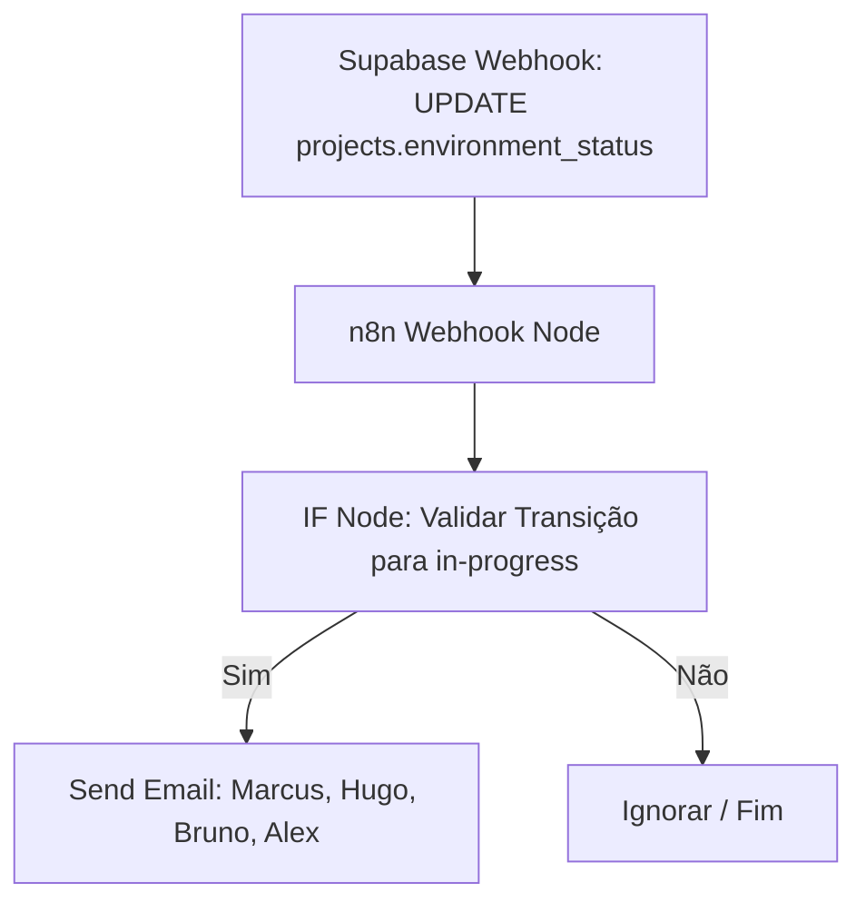

# 🚀 Guia Passo a Passo: Automação de Solicitação de Configuração de Ambiente — Siplan HUB

Este manual técnico orienta a criação, configuração e implantação manual de uma automação no **n8n** integrada ao **Supabase** e **Gmail SMTP**, com o objetivo de notificar a equipe técnica e de gestão quando a etapa **4. Preparação de Ambiente** for iniciada (status alterado para `in-progress`) no painel de projetos do Siplan HUB.

A automação dispara um e-mail estruturado e com layout premium para os analistas de infraestrutura (**Hugo Januário**, **Bruno Fernandes**, **Alex Silva** e **Marcus Ortiz**), solicitando a configuração do servidor local ou em nuvem para o cliente.

---

## 📋 1. Descrição Geral do Fluxo

O progresso de um projeto é acompanhado pelas colunas de status diretamente na tabela `projects`. Quando um usuário altera o status da etapa **4. Preparação de Ambiente** (representada no banco de dados pela coluna `environment_status` na tabela `projects`) para **Em Andamento** (`in-progress`), o Supabase dispara um Database Webhook.

O n8n captura o evento contendo os dados novos e antigos da linha do projeto e envia um e-mail com layout de alta qualidade diretamente para a equipe técnica responsável.



---

## 🛠️ 2. Configuração do Webhook no Supabase (Trigger)

Para que o n8n seja avisado da alteração do status, criamos um Database Webhook no painel do Supabase com o seguinte script SQL de migração (já aplicado no banco de dados):

### Script de Criação (Referência):
```sql
-- Migration: Adicionar trigger n8n para início da preparação de ambiente
DROP TRIGGER IF EXISTS n8n_preparacao_ambiente ON public.projects;

CREATE TRIGGER n8n_preparacao_ambiente
  AFTER UPDATE OF environment_status ON public.projects
  FOR EACH ROW
  WHEN (
    NEW.environment_status = 'in-progress' 
    AND (OLD.environment_status IS DISTINCT FROM 'in-progress')
  )
  EXECUTE FUNCTION supabase_functions.http_request(
    'http://n8n.siplan.com.br:5678/webhook/preparacao-ambiente', 
    'POST', 
    '{"Content-type":"application/json"}', 
    '{}', 
    '5000'
  );
```

### Configurações no Painel do Supabase (Caso queira validar visualmente):
*   **Name:** `n8n_preparacao_ambiente`
*   **Table:** `projects`
*   **Events:** Selecionar apenas **Update**
*   **Method:** `POST`
*   **URL:**
    *   *Ambiente de Testes (n8n Test):* `http://n8n.siplan.com.br:5678/webhook-test/preparacao-ambiente`
    *   *Ambiente de Produção (n8n Prod):* `http://n8n.siplan.com.br:5678/webhook/preparacao-ambiente`
*   **Headers:**
    *   *Key:* `Content-Type`
    *   *Value:* `application/json`

---

## ⚙️ 3. Configuração Passo a Passo dos Nós no n8n

O fluxo no n8n é direto e otimizado, contendo apenas 3 nós necessários, pois o payload completo do projeto é enviado diretamente pelo trigger do Supabase no corpo da requisição POST (em `new_row` / `record`).

### Nó 1: Webhook (Gatilho)
Este nó escuta as chamadas HTTP enviadas pelo webhook do Supabase.
*   **Name:** `Webhook - Preparação de Ambiente`
*   **Authentication:** `None`
*   **HTTP Method:** `POST`
*   **Path:** `preparacao-ambiente`
*   **Response Mode:** `onReceived`
*   **Response Code:** `200`
*   **Options -> Raw Body:** `False`

### Nó 2: IF (Filtro de Transição de Status)
Garante que o fluxo só continue se o status novo for `'in-progress'` e o anterior for diferente de `'in-progress'`, funcionando como redundância e prevenção de loops.
*   **Name:** `IF - Transição para Em Andamento`
*   **Conditions (Combinador):** `AND`
*   > [!IMPORTANT]
    > **Evite o erro `rightType` no n8n:** Ao adicionar cada condição abaixo, clique no botão **Add Condition** (Adicionar Condição) e selecione especificamente o tipo **String** (ou Texto). Se você criar uma condição e ela ficar em branco ou sem tipo selecionado, o n8n falhará com o erro `Cannot read properties of undefined (reading 'rightType')`.
*   *Condição 1 (Tipo: String):*
    *   **Value 1:** `{{ $json.body.record.environment_status }}`
    *   **Operation:** `Equal`
    *   **Value 2:** `in-progress`
*   *Condição 2 (Tipo: String):*
    *   **Value 1:** `{{ $json.body.old_record.environment_status }}`
    *   **Operation:** `Not Equal`
    *   **Value 2:** `in-progress`

### Nó 3: Send Email (SMTP - Solicitação de Configuração)
Dispara o e-mail em formato HTML premium para a equipe.
*   **Name:** `Email - Solicitação de Configuração`
*   **Authentication:** `SMTP Credentials` (utilizar a conta de e-mail remetente padrão do Siplan)
*   **To Email:** `marcus.vinicius@siplan.com.br, hugo.santariosi@siplan.com.br, bruno.fernandes@siplan.com.br, alex.silva@siplan.com.br`
*   **Subject:** `⚙️ [SIPLAN HUB] Solicitação de Preparação de Ambiente — {{ $json.body.record.client_name }} (#{{ $json.body.record.ticket_number }})`
*   **Format:** `HTML`
*   **Body (HTML):** *(Código HTML completo disponível na Seção 4)*

---

## ✉️ 4. Modelo do E-mail (HTML Premium)

O e-mail foi projetado de acordo com a identidade visual do Siplan HUB (Vermelho Bordô `#ad0505` como destaque e estilo Dark/Light limpo), organizando as informações técnicas e os próximos passos.

```html
<!DOCTYPE html>
<html lang="pt-BR">
<head>
  <meta charset="UTF-8">
  <meta name="viewport" content="width=device-width, initial-scale=1.0">
  <title>Solicitação de Configuração de Ambiente</title>
</head>
<body style="margin: 0; padding: 0; background-color: #f8fafc; font-family: 'Segoe UI', -apple-system, BlinkMacSystemFont, Roboto, Helvetica, Arial, sans-serif; color: #1e293b; line-height: 1.6;">
  <table width="100%" border="0" cellspacing="0" cellpadding="0" style="background-color: #f8fafc; padding: 20px 40px;">
    <tr>
      <td align="center">
        <table width="100%" border="0" cellspacing="0" cellpadding="0" style="background-color: #ffffff; border-radius: 12px; overflow: hidden; box-shadow: 0 10px 15px -3px rgba(15, 23, 42, 0.05), 0 4px 6px -2px rgba(15, 23, 42, 0.05); border: 1px solid #e2e8f0; max-width: 650px;">
          <!-- Cabeçalho -->
          <tr>
            <td style="background-color: #0f172a; padding: 28px 40px; text-align: left;">
              <span style="color: #ad0505; font-size: 11px; font-weight: bold; text-transform: uppercase; letter-spacing: 2px; display: block; margin-bottom: 4px;">INFRAESTRUTURA TÉCNICA</span>
              <h1 style="color: #ffffff; font-size: 22px; margin: 0; font-weight: 800; letter-spacing: -0.5px;">SIPLAN <span style="color: #ad0505;">HUB</span></h1>
            </td>
          </tr>
          <!-- Linha Decorativa Vermelha -->
          <tr>
            <td height="4" style="background-color: #ad0505; line-height: 4px; font-size: 4px;">&nbsp;</td>
          </tr>
          <!-- Corpo do E-mail -->
          <tr>
            <td style="padding: 40px 40px;">
              <!-- Badge de Alerta -->
              <table border="0" cellspacing="0" cellpadding="0" style="margin-bottom: 25px;">
                <tr>
                  <td>
                    <span style="background-color: #fffbeb; color: #b45309; border: 1px solid #fde68a; padding: 6px 14px; border-radius: 50px; font-size: 12px; font-weight: 700; text-transform: uppercase; letter-spacing: 0.5px; display: inline-block;">
                      ⚙️ CONFIGURAÇÃO DE AMBIENTE REQUERIDA
                    </span>
                  </td>
                </tr>
              </table>

              <h2 style="color: #0f172a; font-size: 20px; margin-top: 0; margin-bottom: 12px; font-weight: 700; letter-spacing: -0.3px;">Preparação de Ambiente Iniciada</h2>
              <p style="font-size: 15px; color: #475569; margin-bottom: 20px;">Olá equipe de infraestrutura,</p>
              <p style="font-size: 15px; color: #475569; margin-bottom: 20px;">
                O progresso do projeto do cliente abaixo foi atualizado. A etapa **4. Preparação de Ambiente** foi alterada para <strong style="color: #b45309;">Em Andamento</strong>. Por favor, realizem a configuração técnica do servidor e banco de dados para a implantação.
              </p>
              
              <!-- Card de Detalhes do Projeto -->
              <table width="100%" border="0" cellspacing="0" cellpadding="14" style="background-color: #f8fafc; border-radius: 8px; margin: 25px 0; border: 1px solid #e2e8f0; border-left: 4px solid #ad0505; font-size: 14px;">
                <tr>
                  <td width="25%" style="font-weight: bold; color: #64748b; text-transform: uppercase; font-size: 11px; letter-spacing: 0.5px;">Cliente:</td>
                  <td style="color: #1e293b; font-weight: 700;">{{ $json.body.record.client_name }}</td>
                </tr>
                <tr>
                  <td style="font-weight: bold; color: #64748b; text-transform: uppercase; font-size: 11px; letter-spacing: 0.5px;">Nº Chamado:</td>
                  <td style="color: #1e293b; font-weight: 600;">#{{ $json.body.record.ticket_number }}</td>
                </tr>
                <tr>
                  <td style="font-weight: bold; color: #64748b; text-transform: uppercase; font-size: 11px; letter-spacing: 0.5px;">Sistema:</td>
                  <td style="color: #ad0505; font-weight: bold;">{{ $json.body.record.system_type }}</td>
                </tr>
              </table>

              <!-- Bloco A Bola Está com Você -->
              <table width="100%" border="0" cellspacing="0" cellpadding="0" style="background-color: #fff5f5; border-radius: 8px; border: 1px dashed #feb2b2; margin-top: 25px; padding: 25px; text-align: left;">
                <tr>
                  <td>
                    <h3 style="color: #ad0505; font-size: 14px; margin: 0 0 12px 0; font-weight: bold; text-transform: uppercase; letter-spacing: 0.5px;">
                      🎯 A BOLA ESTÁ COM VOCÊ — PRÓXIMOS PASSOS:
                    </h3>
                    <ul style="margin: 0; padding-left: 20px; color: #475569; font-size: 14px; line-height: 1.8;">
                      <li style="margin-bottom: 8px;"><strong style="color: #475569;">📞 Contato com o TI:</strong> Entrar em contato com o TI do cartório.</li>
                      <li style="margin-bottom: 8px;"><strong style="color: #475569;">🔑 Solicitação de Acesso:</strong> Solicitar o acesso ao servidor do cliente.</li>
                      <li style="margin-bottom: 8px;"><strong style="color: #475569;">⚙️ Configurações Padrões:</strong> Iniciar os procedimentos padrões de configurações de ambiente.</li>
                      <li style="margin-bottom: 0;"><strong style="color: #ad0505;">🔴 FINALIZAR NO HUB:</strong> Ao finalizar a configuração, volte ao HUB, atualize a etapa <strong>"4. Preparação de Ambiente"</strong> para o status concluído (done) e cadastre as informações adicionais geradas.</li>
                    </ul>
                  </td>
                </tr>
              </table>

              <!-- Botão Acessar Projeto -->
              <table width="100%" border="0" cellspacing="0" cellpadding="0" style="margin-top: 30px;">
                <tr>
                  <td align="center">
                    <a href="https://hub.siplan.com.br/projects/{{ $json.body.record.id }}" style="background-color: #ad0505; color: #ffffff; padding: 14px 35px; text-decoration: none; border-radius: 6px; font-weight: bold; font-size: 14px; display: inline-block; box-shadow: 0 4px 6px -1px rgba(173, 5, 5, 0.2), 0 2px 4px -1px rgba(173, 5, 5, 0.1); text-transform: uppercase; letter-spacing: 0.5px;">Configurar no Siplan HUB</a>
                  </td>
                </tr>
              </table>
            </td>
          </tr>
          <!-- Rodapé -->
          <tr>
            <td style="background-color: #f8fafc; padding: 25px 40px; text-align: center; font-size: 11px; color: #94a3b8; border-top: 1px solid #f1f5f9;">
              E-mail gerado automaticamente pelo orquestrador invisível do Siplan HUB.<br>
              Por favor, não responda diretamente a esta mensagem.
            </td>
          </tr>
        </table>
      </td>
    </tr>
  </table>
</body>
</html>
```

---

## 🧪 5. Scripts de Simulação e Testes (Supabase)

Para testar a integração antes de homologar em produção no n8n, utilize as queries SQL abaixo para simular a mudança de status e validar o disparo.

### 1. Selecionar um Projeto de Teste em Status Pendente (`todo`)
```sql
SELECT id, client_name, environment_status 
FROM public.projects 
WHERE environment_status = 'todo' 
LIMIT 1;
```
*(Anote o ID do projeto retornado, por exemplo: `cd879ae2-f6d3-4f28-b717-38a32d9a976b`)*

### 2. Simular Transição para Em Andamento (`in-progress`) - Transação Segura com Rollback
Utilize este bloco de script no painel SQL do Supabase. Ele aplica o update, consulta o log de disparo do webhook e desfaz a alteração para não alterar dados reais:
```sql
BEGIN;

-- Força a atualização do status da etapa
UPDATE public.projects 
SET environment_status = 'in-progress' 
WHERE id = 'SEU_ID_AQUI';

-- Consulta o log de ganchos criados pelo trigger
SELECT * FROM supabase_functions.hooks 
WHERE hook_name = 'n8n_preparacao_ambiente' 
ORDER BY created_at DESC 
LIMIT 1;

-- Desfaz o update para segurança de dados
ROLLBACK;
```

*   **Resultado Esperado:** O select deve retornar uma linha com `hook_name` igual a `'n8n_preparacao_ambiente'`, demonstrando que o trigger interceptou a mudança perfeitamente e enviou a chamada HTTP para o n8n.
