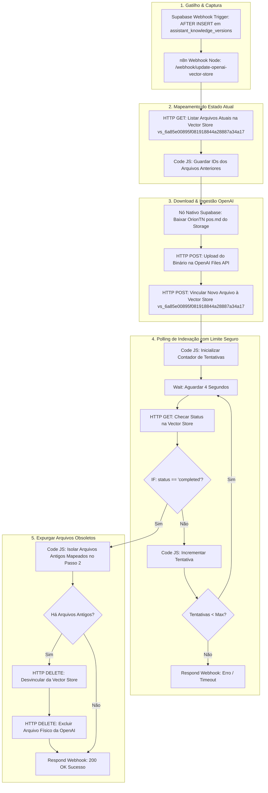

# 🚀 Guia Técnico: Sincronização Contínua e Rotação da Vector Store OpenAI com Zero Downtime — Siplan HUB

Este manual técnico orienta a criação, configuração, importação e implantação no **n8n** da automação de rotação e sincronização da base de conhecimento da IA (**Biblioteca de Conhecimento Orion TN**) com a **OpenAI Vector Store (Assistants API v2)**.

O objetivo do fluxo é garantir que, sempre que analistas do Service Desk editarem e salvarem um tutorial ou procedimento no Siplan HUB, a nova versão do arquivo Markdown (`OrionTN pos.md`) seja baixada via nó nativo do Supabase, enviada para a OpenAI, indexada na Vector Store ativa (**`vs_6a85e00895f081918844a28887a34a17`**) utilizando suas credenciais cadastradas da OpenAI API e as versões obsoletas anteriores sejam expurgadas **estritamente após a conclusão bem-sucedida da indexação** (**Zero Downtime**).

---

## 📋 1. Descrição Geral do Fluxo

A arquitetura de rotação com Zero Downtime garante que em nenhum momento o Assistente fique sem arquivos de suporte ou responda com base vazia:



---

## 🛠️ 2. Configuração do Webhook no Supabase (Trigger & Banco)

O webhook já foi criado e registrado no Supabase com sucesso através da migration:

### 2.1. Trigger de Banco de Dados (`Database Webhook`)
*   **Trigger Name:** `n8n_openai_vector_webhook_trigger`
*   **Table:** `public.assistant_knowledge_versions`
*   **Event:** `AFTER INSERT`
*   **Target URL:** `http://n8n.siplan.com.br:5678/webhook/update-openai-vector-store`
*   **Function:** `supabase_functions.http_request`

### 2.2. SQL de Referência Aplicado no Supabase:
```sql
-- Trigger automático no Supabase
CREATE TRIGGER n8n_openai_vector_webhook_trigger
  AFTER INSERT ON public.assistant_knowledge_versions
  FOR EACH ROW
  EXECUTE FUNCTION supabase_functions.http_request(
    'http://n8n.siplan.com.br:5678/webhook/update-openai-vector-store',
    'POST',
    '{"Content-type":"application/json"}',
    '{}',
    '5000'
  );
```

---

## ⚙️ 3. Passo a Passo Manual no n8n

### Passo 1: Importar o Workflow Atualizado
1. Acesse seu painel n8n em: **`http://n8n.siplan.com.br:5678/`**
2. No menu lateral esquerdo, clique em **Workflows** e depois em **Add Workflow** (ou abra um novo).
3. No canto superior direito da tela do editor de workflow, clique no menu de **três pontinhos (...)** e selecione **"Import from File"** ou **"Import from Clipboard"**.
4. Selecione o arquivo [`n8n-workflow-sync-openai-vector-store.json`](file:///c:/Users/marcu/Desktop/Projects/siplan-hub/docs/automacoes/n8n-workflow-sync-openai-vector-store.json) (ou copie o JSON da seção 4).

### Passo 2: Vincular as Credenciais Nativas Cadastradas

1. **Nó do Supabase (`Baixar Markdown do Supabase Storage`):**
   - Dê um duplo clique no nó.
   - No campo **Credential for Supabase API**, selecione a sua conta já cadastrada do **Supabase**.

2. **Nós da OpenAI:**
   - Dê um duplo clique nos nós abaixo:
     - `Mapear Arquivos Atuais na Vector Store`
     - `Upload para OpenAI Files API`
     - `Vincular Novo Arquivo à Vector Store`
     - `Verificar Status de Indexação na Vector Store`
     - `Desvincular Arquivo Antigo da Vector Store`
     - `Deletar Arquivo Físico da Conta OpenAI`
   - No campo **Credential for OpenAI API**, selecione a sua conta já cadastrada da **OpenAI**.

### Passo 3: Ativar o Workflow
1. No canto superior direito do n8n, mude a chave de **Inactive** para **Active** (Ativo).
2. O webhook responderá automaticamente no endpoint de produção:
   `http://n8n.siplan.com.br:5678/webhook/update-openai-vector-store`

---

## 📦 4. JSON Completo do Workflow para Importação

```json
{
  "name": "Siplan HUB - Sincronização OpenAI Vector Store (Zero Downtime)",
  "nodes": [
    {
      "parameters": {
        "httpMethod": "POST",
        "path": "update-openai-vector-store",
        "responseMode": "responseNode",
        "options": {
          "rawBody": false
        }
      },
      "id": "webhook-trigger",
      "name": "Webhook - Atualização Base Orion TN",
      "type": "n8n-nodes-base.webhook",
      "typeVersion": 2,
      "position": [200, 300],
      "webhookId": "update-openai-vector-store"
    },
    {
      "parameters": {
        "authentication": "predefinedCredentialType",
        "nodeCredentialType": "openAiApi",
        "url": "https://api.openai.com/v1/vector_stores/vs_6a85e00895f081918844a28887a34a17/files?limit=100",
        "sendHeaders": true,
        "headerParameters": {
          "parameters": [
            {
              "name": "OpenAI-Beta",
              "value": "assistants=v2"
            }
          ]
        },
        "options": {}
      },
      "id": "list-current-files",
      "name": "Mapear Arquivos Atuais na Vector Store",
      "type": "n8n-nodes-base.httpRequest",
      "typeVersion": 4.2,
      "position": [460, 300],
      "credentials": {
        "openAiApi": {
          "id": "",
          "name": "OpenAI account"
        }
      }
    },
    {
      "parameters": {
        "jsCode": "const currentFiles = $input.first().json.data || [];\nconst existingFileIds = currentFiles.map(f => f.id).filter(Boolean);\n\nconst webhookBody = $node[\"Webhook - Atualização Base Orion TN\"].json.body || {};\nconst record = webhookBody.record || {};\n\nconst bucket = record.bucket || webhookBody.bucket || 'assistant-oriontn-doc';\nconst filePath = record.file_path || webhookBody.file_path || 'OrionTN pos.md';\nconst versionTag = record.version_tag || webhookBody.version_tag || 'v1';\nconst articleId = record.article_id || webhookBody.article_id || '';\nconst summaryChanges = record.summary_changes || webhookBody.summary_changes || '';\nconst author = record.author_name || webhookBody.updated_by_name || record.author_email || webhookBody.updated_by || '';\n\nreturn [{\n  json: {\n    existing_file_ids: existingFileIds,\n    existing_files_count: existingFileIds.length,\n    vector_store_id: 'vs_6a85e00895f081918844a28887a34a17',\n    bucket,\n    file_path: filePath,\n    version_tag: versionTag,\n    article_id: articleId,\n    summary_changes: summaryChanges,\n    author\n  }\n}];"
      },
      "id": "store-old-file-ids",
      "name": "Guardar Lista de Arquivos Antigos",
      "type": "n8n-nodes-base.code",
      "typeVersion": 2,
      "position": [700, 300]
    },
    {
      "parameters": {
        "resource": "file",
        "operation": "download",
        "bucketId": "={{ $json.bucket }}",
        "file": "={{ $json.file_path }}"
      },
      "id": "download-file-supabase",
      "name": "Baixar Markdown do Supabase Storage",
      "type": "n8n-nodes-base.supabase",
      "typeVersion": 1,
      "position": [940, 300],
      "credentials": {
        "supabaseApi": {
          "id": "",
          "name": "Supabase account"
        }
      }
    },
    {
      "parameters": {
        "method": "POST",
        "authentication": "predefinedCredentialType",
        "nodeCredentialType": "openAiApi",
        "url": "https://api.openai.com/v1/files",
        "sendBody": true,
        "contentType": "multipart-form-data",
        "bodyParameters": {
          "parameters": [
            {
              "name": "purpose",
              "value": "assistants"
            },
            {
              "parameterType": "formBinaryData",
              "name": "file",
              "inputDataFieldName": "data"
            }
          ]
        },
        "options": {}
      },
      "id": "upload-openai-file",
      "name": "Upload para OpenAI Files API",
      "type": "n8n-nodes-base.httpRequest",
      "typeVersion": 4.2,
      "position": [1180, 300],
      "credentials": {
        "openAiApi": {
          "id": "",
          "name": "OpenAI account"
        }
      }
    },
    {
      "parameters": {
        "method": "POST",
        "authentication": "predefinedCredentialType",
        "nodeCredentialType": "openAiApi",
        "url": "https://api.openai.com/v1/vector_stores/vs_6a85e00895f081918844a28887a34a17/files",
        "sendHeaders": true,
        "headerParameters": {
          "parameters": [
            {
              "name": "OpenAI-Beta",
              "value": "assistants=v2"
            },
            {
              "name": "Content-Type",
              "value": "application/json"
            }
          ]
        },
        "sendBody": true,
        "specifyBody": "json",
        "jsonBody": "={\n  \"file_id\": \"{{ $json.id }}\"\n}",
        "options": {}
      },
      "id": "attach-file-vector-store",
      "name": "Vincular Novo Arquivo à Vector Store",
      "type": "n8n-nodes-base.httpRequest",
      "typeVersion": 4.2,
      "position": [1420, 300],
      "credentials": {
        "openAiApi": {
          "id": "",
          "name": "OpenAI account"
        }
      }
    },
    {
      "parameters": {
        "jsCode": "const newFileId = $node[\"Upload para OpenAI Files API\"].json.id;\nconst vectorStoreId = \"vs_6a85e00895f081918844a28887a34a17\";\n\nreturn [{\n  json: {\n    new_file_id: newFileId,\n    vector_store_id: vectorStoreId,\n    attempt: 1,\n    max_attempts: 25,\n    status: 'in_progress'\n  }\n}];"
      },
      "id": "init-polling",
      "name": "Iniciar Polling de Indexação",
      "type": "n8n-nodes-base.code",
      "typeVersion": 2,
      "position": [1660, 300]
    },
    {
      "parameters": {
        "amount": 4,
        "unit": "seconds"
      },
      "id": "wait-polling",
      "name": "Aguardar Indexação (4s)",
      "type": "n8n-nodes-base.wait",
      "typeVersion": 1.1,
      "position": [1880, 300]
    },
    {
      "parameters": {
        "authentication": "predefinedCredentialType",
        "nodeCredentialType": "openAiApi",
        "url": "=https://api.openai.com/v1/vector_stores/vs_6a85e00895f081918844a28887a34a17/files/{{ $json.new_file_id }}",
        "sendHeaders": true,
        "headerParameters": {
          "parameters": [
            {
              "name": "OpenAI-Beta",
              "value": "assistants=v2"
            }
          ]
        },
        "options": {}
      },
      "id": "check-index-status",
      "name": "Verificar Status de Indexação na Vector Store",
      "type": "n8n-nodes-base.httpRequest",
      "typeVersion": 4.2,
      "position": [2100, 300],
      "credentials": {
        "openAiApi": {
          "id": "",
          "name": "OpenAI account"
        }
      }
    },
    {
      "parameters": {
        "conditions": {
          "options": {
            "caseSensitive": true,
            "leftValue": "",
            "typeValidation": "strict",
            "version": 2
          },
          "conditions": [
            {
              "id": "cond-completed",
              "leftValue": "={{ $json.status }}",
              "rightValue": "completed",
              "operator": {
                "type": "string",
                "operation": "equals"
              }
            }
          ],
          "combinator": "and"
        },
        "options": {}
      },
      "id": "if-index-completed",
      "name": "IF - Indexação Concluída?",
      "type": "n8n-nodes-base.if",
      "typeVersion": 2.2,
      "position": [2340, 300]
    },
    {
      "parameters": {
        "jsCode": "const currentAttempt = ($node[\"Aguardar Indexação (4s)\"].json.attempt || 1) + 1;\nconst maxAttempts = $node[\"Iniciar Polling de Indexação\"].json.max_attempts || 25;\nconst newFileId = $node[\"Iniciar Polling de Indexação\"].json.new_file_id;\nconst vectorStoreId = \"vs_6a85e00895f081918844a28887a34a17\";\nconst currentStatus = $input.first().json.status || 'in_progress';\n\nreturn [{\n  json: {\n    attempt: currentAttempt,\n    max_attempts: maxAttempts,\n    new_file_id: newFileId,\n    vector_store_id: vectorStoreId,\n    status: currentStatus,\n    has_more_attempts: currentAttempt <= maxAttempts\n  }\n}];"
      },
      "id": "increment-attempt",
      "name": "Incrementar Tentativas",
      "type": "n8n-nodes-base.code",
      "typeVersion": 2,
      "position": [2340, 500]
    },
    {
      "parameters": {
        "conditions": {
          "options": {
            "caseSensitive": true,
            "leftValue": "",
            "typeValidation": "strict",
            "version": 2
          },
          "conditions": [
            {
              "id": "cond-has-attempts",
              "leftValue": "={{ $json.has_more_attempts }}",
              "rightValue": true,
              "operator": {
                "type": "boolean",
                "operation": "equals"
              }
            }
          ],
          "combinator": "and"
        },
        "options": {}
      },
      "id": "if-has-more-attempts",
      "name": "IF - Tentativas Restantes?",
      "type": "n8n-nodes-base.if",
      "typeVersion": 2.2,
      "position": [2560, 500]
    },
    {
      "parameters": {
        "jsCode": "const oldFileIds = $node[\"Guardar Lista de Arquivos Antigos\"].json.existing_file_ids || [];\nconst newFileId = $node[\"Upload para OpenAI Files API\"].json.id;\nconst vectorStoreId = \"vs_6a85e00895f081918844a28887a34a17\";\n\nconst obsoleteIds = oldFileIds.filter(id => id && id !== newFileId);\n\nif (obsoleteIds.length === 0) {\n  return [{\n    json: {\n      has_obsolete_files: false,\n      total_obsolete: 0,\n      new_file_id: newFileId,\n      vector_store_id: vectorStoreId,\n      message: \"Nenhum arquivo anterior obsoleto para expurgar.\"\n    }\n  }];\n}\n\nreturn obsoleteIds.map(oldId => ({\n  json: {\n    has_obsolete_files: true,\n    old_file_id: oldId,\n    new_file_id: newFileId,\n    vector_store_id: vectorStoreId,\n    total_obsolete: obsoleteIds.length\n  }\n}));"
      },
      "id": "filter-obsolete-files",
      "name": "Isolar Arquivos Obsoletos para Exclusão",
      "type": "n8n-nodes-base.code",
      "typeVersion": 2,
      "position": [2580, 220]
    },
    {
      "parameters": {
        "conditions": {
          "options": {
            "caseSensitive": true,
            "leftValue": "",
            "typeValidation": "strict",
            "version": 2
          },
          "conditions": [
            {
              "id": "cond-has-obsolete",
              "leftValue": "={{ $json.has_obsolete_files }}",
              "rightValue": true,
              "operator": {
                "type": "boolean",
                "operation": "equals"
              }
            }
          ],
          "combinator": "and"
        },
        "options": {}
      },
      "id": "if-has-obsolete",
      "name": "IF - Há Arquivos Obsoletos?",
      "type": "n8n-nodes-base.if",
      "typeVersion": 2.2,
      "position": [2800, 220]
    },
    {
      "parameters": {
        "method": "DELETE",
        "authentication": "predefinedCredentialType",
        "nodeCredentialType": "openAiApi",
        "url": "=https://api.openai.com/v1/vector_stores/vs_6a85e00895f081918844a28887a34a17/files/{{ $json.old_file_id }}",
        "sendHeaders": true,
        "headerParameters": {
          "parameters": [
            {
              "name": "OpenAI-Beta",
              "value": "assistants=v2"
            }
          ]
        },
        "options": {}
      },
      "id": "detach-old-file",
      "name": "Desvincular Arquivo Antigo da Vector Store",
      "type": "n8n-nodes-base.httpRequest",
      "typeVersion": 4.2,
      "position": [3020, 140],
      "credentials": {
        "openAiApi": {
          "id": "",
          "name": "OpenAI account"
        }
      }
    },
    {
      "parameters": {
        "method": "DELETE",
        "authentication": "predefinedCredentialType",
        "nodeCredentialType": "openAiApi",
        "url": "=https://api.openai.com/v1/files/{{ $json.old_file_id }}",
        "sendHeaders": true,
        "options": {}
      },
      "id": "delete-old-file-openai",
      "name": "Deletar Arquivo Físico da Conta OpenAI",
      "type": "n8n-nodes-base.httpRequest",
      "typeVersion": 4.2,
      "position": [3240, 140],
      "credentials": {
        "openAiApi": {
          "id": "",
          "name": "OpenAI account"
        }
      }
    },
    {
      "parameters": {
        "respondWith": "json",
        "responseBody": "={\n  \"status\": \"success\",\n  \"message\": \"Base de conhecimento Orion TN sincronizada com sucesso na OpenAI Vector Store com Zero Downtime!\",\n  \"vector_store_id\": \"vs_6a85e00895f081918844a28887a34a17\",\n  \"new_file_id\": \"{{ $node[\"Upload para OpenAI Files API\"].json.id }}\",\n  \"version_tag\": \"{{ $node[\"Guardar Lista de Arquivos Antigos\"].json.version_tag }}\",\n  \"article_id\": \"{{ $node[\"Guardar Lista de Arquivos Antigos\"].json.article_id }}\",\n  \"summary_changes\": \"{{ $node[\"Guardar Lista de Arquivos Antigos\"].json.summary_changes }}\",\n  \"author\": \"{{ $node[\"Guardar Lista de Arquivos Antigos\"].json.author }}\",\n  \"indexed_at\": \"{{ $now.toISO() }}\"\n}",
        "options": {
          "responseCode": 200
        }
      },
      "id": "respond-success",
      "name": "Responder Sucesso ao Webhook",
      "type": "n8n-nodes-base.respondToWebhook",
      "typeVersion": 1.1,
      "position": [3500, 300]
    },
    {
      "parameters": {
        "respondWith": "json",
        "responseBody": "={\n  \"status\": \"error\",\n  \"message\": \"Timeout na indexação do arquivo na OpenAI Vector Store após múltiplas tentativas.\",\n  \"vector_store_id\": \"vs_6a85e00895f081918844a28887a34a17\",\n  \"new_file_id\": \"{{ $node[\"Iniciar Polling de Indexação\"].json.new_file_id }}\",\n  \"last_status\": \"{{ $json.status }}\"\n}",
        "options": {
          "responseCode": 500
        }
      },
      "id": "respond-timeout",
      "name": "Responder Erro / Timeout",
      "type": "n8n-nodes-base.respondToWebhook",
      "typeVersion": 1.1,
      "position": [2780, 600]
    }
  ],
  "connections": {
    "Webhook - Atualização Base Orion TN": {
      "main": [[{"node": "Mapear Arquivos Atuais na Vector Store", "type": "main", "index": 0}]]
    },
    "Mapear Arquivos Atuais na Vector Store": {
      "main": [[{"node": "Guardar Lista de Arquivos Antigos", "type": "main", "index": 0}]]
    },
    "Guardar Lista de Arquivos Antigos": {
      "main": [[{"node": "Baixar Markdown do Supabase Storage", "type": "main", "index": 0}]]
    },
    "Baixar Markdown do Supabase Storage": {
      "main": [[{"node": "Upload para OpenAI Files API", "type": "main", "index": 0}]]
    },
    "Upload para OpenAI Files API": {
      "main": [[{"node": "Vincular Novo Arquivo à Vector Store", "type": "main", "index": 0}]]
    },
    "Vincular Novo Arquivo à Vector Store": {
      "main": [[{"node": "Iniciar Polling de Indexação", "type": "main", "index": 0}]]
    },
    "Iniciar Polling de Indexação": {
      "main": [[{"node": "Aguardar Indexação (4s)", "type": "main", "index": 0}]]
    },
    "Aguardar Indexação (4s)": {
      "main": [[{"node": "Verificar Status de Indexação na Vector Store", "type": "main", "index": 0}]]
    },
    "Verificar Status de Indexação na Vector Store": {
      "main": [[{"node": "IF - Indexação Concluída?", "type": "main", "index": 0}]]
    },
    "IF - Indexação Concluída?": {
      "main": [
        [{"node": "Isolar Arquivos Obsoletos para Exclusão", "type": "main", "index": 0}],
        [{"node": "Incrementar Tentativas", "type": "main", "index": 0}]
      ]
    },
    "Incrementar Tentativas": {
      "main": [[{"node": "IF - Tentativas Restantes?", "type": "main", "index": 0}]]
    },
    "IF - Tentativas Restantes?": {
      "main": [
        [{"node": "Aguardar Indexação (4s)", "type": "main", "index": 0}],
        [{"node": "Responder Erro / Timeout", "type": "main", "index": 0}]
      ]
    },
    "Isolar Arquivos Obsoletos para Exclusão": {
      "main": [[{"node": "IF - Há Arquivos Obsoletos?", "type": "main", "index": 0}]]
    },
    "IF - Há Arquivos Obsoletos?": {
      "main": [
        [{"node": "Desvincular Arquivo Antigo da Vector Store", "type": "main", "index": 0}],
        [{"node": "Responder Sucesso ao Webhook", "type": "main", "index": 0}]
      ]
    },
    "Desvincular Arquivo Antigo da Vector Store": {
      "main": [[{"node": "Deletar Arquivo Físico da Conta OpenAI", "type": "main", "index": 0}]]
    },
    "Deletar Arquivo Físico da Conta OpenAI": {
      "main": [[{"node": "Responder Sucesso ao Webhook", "type": "main", "index": 0}]]
    }
  },
  "settings": {
    "executionOrder": "v1"
  }
}
