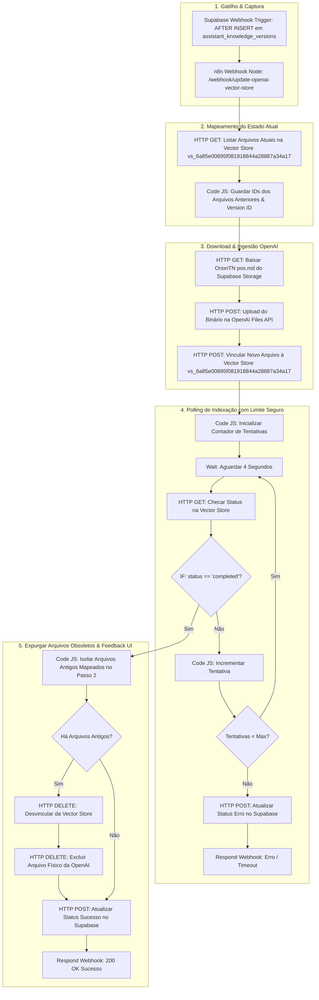

# 🚀 Guia Técnico: Sincronização Contínua e Rotação da Vector Store OpenAI com Zero Downtime — Siplan HUB

Este manual técnico orienta a criação, configuração, importação e implantação no **n8n** da automação de rotação e sincronização da base de conhecimento da IA (**Biblioteca de Conhecimento Orion TN**) com a **OpenAI Vector Store (Assistants API v2)**.

O objetivo do fluxo é garantir que, sempre que analistas do Service Desk editarem e salvarem um tutorial ou procedimento no Siplan HUB, a nova versão do arquivo Markdown (`OrionTN pos.md`) seja enviada para a OpenAI, indexada na Vector Store ativa (**`vs_6a85e00895f081918844a28887a34a17`**) e as versões obsoletas anteriores sejam expurgadas **estritamente após a conclusão bem-sucedida da indexação** (**Zero Downtime**). Além disso, o workflow atualiza em tempo real o status no Supabase para que a interface informe o usuário sobre o sucesso ou falha da indexação na IA.

---

## 📋 1. Descrição Geral do Fluxo

A arquitetura de rotação com Zero Downtime e feedback de status em tempo real opera conforme o diagrama abaixo:



---

## 🛠️ 2. Configuração do Webhook no Supabase (Trigger & Banco)

O webhook já foi criado e registrado no Supabase com sucesso através da migration:

### 2.1. Trigger de Banco de Dados (`Database Webhook`)
*   **Trigger Name:** `n8n_openai_vector_webhook_trigger`
*   **Table:** `public.assistant_knowledge_versions`
*   **Event:** `AFTER INSERT`
*   **Target URL:** `http://n8n.siplan.com.br:5678/webhook/update-openai-vector-store`
*   **Function:** `supabase_functions.http_request`

### 2.2. SQL de Referência Aplicado no Supabase:
```sql
-- Trigger automático no Supabase
CREATE TRIGGER n8n_openai_vector_webhook_trigger
  AFTER INSERT ON public.assistant_knowledge_versions
  FOR EACH ROW
  EXECUTE FUNCTION supabase_functions.http_request(
    'http://n8n.siplan.com.br:5678/webhook/update-openai-vector-store',
    'POST',
    '{"Content-type":"application/json"}',
    '{}',
    '5000'
  );
```

---

## ⚙️ 3. Passo a Passo Manual no n8n

### Passo 1: Importar o Workflow Atualizado
1. Acesse seu painel n8n em: **`http://n8n.siplan.com.br:5678/`**
2. No menu lateral esquerdo, clique em **Workflows** e abra o fluxo atual (ou crie um novo).
3. No canto superior direito da tela do editor de workflow, clique no menu de **três pontinhos (...)** e selecione **"Import from File"** ou **"Import from Clipboard"**.
4. Selecione o arquivo [`n8n-workflow-sync-openai-vector-store.json`](file:///c:/Users/marcu/Desktop/Projects/siplan-hub/docs/automacoes/n8n-workflow-sync-openai-vector-store.json).

### Passo 2: Vincular as Credenciais Salvas

1. **Nós do Supabase:**
   - Dê um duplo clique nos nós abaixo e selecione a sua conta do **Supabase** no campo **Credential for Supabase API**:
     - `Baixar Markdown do Supabase Storage`
     - `Atualizar Status Sucesso no Supabase`
     - `Atualizar Status Erro no Supabase`

2. **Nós da OpenAI:**
   - Dê um duplo clique nos nós abaixo e selecione a sua conta da **OpenAI** no campo **Credential for OpenAI API**:
     - `Mapear Arquivos Atuais na Vector Store`
     - `Upload para OpenAI Files API`
     - `Vincular Novo Arquivo à Vector Store`
     - `Verificar Status de Indexação na Vector Store`
     - `Desvincular Arquivo Antigo da Vector Store`
     - `Deletar Arquivo Físico da Conta OpenAI`

### Passo 3: Ativar o Workflow
1. No canto superior direito do n8n, mude a chave de **Inactive** para **Active** (Ativo).
2. O webhook responderá automaticamente no endpoint:
   `http://n8n.siplan.com.br:5678/webhook/update-openai-vector-store`

---

## 📦 4. JSON Completo do Workflow para Importação

Consulte o arquivo [`n8n-workflow-sync-openai-vector-store.json`](file:///c:/Users/marcu/Desktop/Projects/siplan-hub/docs/automacoes/n8n-workflow-sync-openai-vector-store.json) para o JSON completo pronto para importação.

---

## 🧪 5. Feedback em Tempo Real na Tela do Usuário

Com esta arquitetura implementada:
1. **Ao Salvar no Siplan HUB:** O modal não se fecha abruptamente; ele exibe um pipeline de progresso dinâmico de 2 etapas:
   - **Etapa 1:** *Supabase Storage & Backup Histórico* (Instantâneo - ~1s).
   - **Etapa 2:** *Indexação na OpenAI Vector Store com Zero Downtime* (com contador de segundos decorridos).
2. **Confirmação de Sucesso:** Assim que a OpenAI finaliza a indexação, o n8n atualiza o status para `synced`, o modal passa a exibir o badge verde com o `OpenAI File ID` gerado e a confirmação de que a IA já está respondendo com os tutoriais atualizados.
3. **Tratamento de Falha:** Se houver timeout ou erro na OpenAI, o status é marcado como `failed` e a tela informa imediatamente a mensagem de erro ao usuário.
